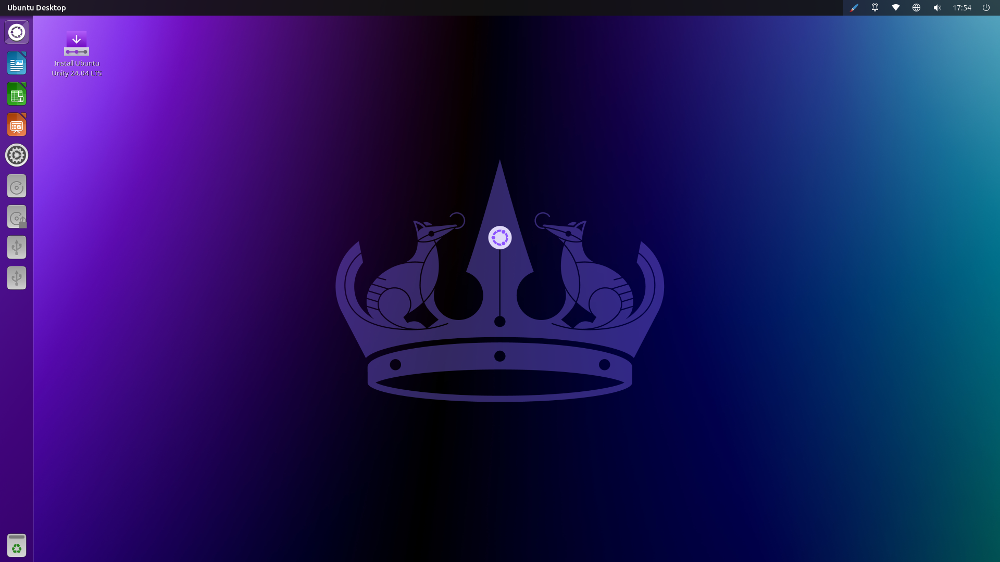

# Introduction

Future hacker? Future Linux system administrator? Future DevOps engineer? Just curious or passionate about computers? Let’s explore together the wonderful universe of Linux — that famous open-source operating system everyone seems to fear.

## Foreword

We recommend **not using AI to complete the exercises**, as you are currently in a learning phase.

# 1. A Brief History of Linux

Linux was born in 1991, created by Linus Torvalds, a Finnish student inspired by UNIX — a powerful and modular operating system developed in the 1970s by Ken Thompson, Dennis Ritchie, and others at Bell Labs. UNIX was known for its stability and portability, but its code wasn’t free. Torvalds aimed to recreate a similar system, free and open, by releasing the Linux kernel, which he shared with the community.

By combining it with the tools from the GNU project (started by Richard Stallman in the 1980s to build a free UNIX-like operating system), Linux became a complete OS, often called GNU/Linux. It inherited UNIX's multi-user and multitasking concepts, while evolving through open source. Today, Linux dominates the server, supercomputer, and smartphone markets (through Android), often surpassing UNIX in popularity.

Here’s a quick recap of key takeaways:

- **UNIX as inspiration**: Created in the 1970s at Bell Labs, UNIX introduced key concepts (stability, modularity, multi-user) that influenced Linux, although UNIX remained proprietary.

- **Linux, a free alternative**: In 1991, Linus Torvalds developed the Linux kernel, inspired by UNIX, and made it open source — launching a global collaborative project.

- **The GNU Project’s role**: Started by Richard Stallman in the 1980s, GNU provided tools that, combined with the Linux kernel, resulted in a fully free UNIX-like system.

- **The power of open source**: The global community helped evolve Linux, making it adaptable and dominant in servers, supercomputers, and smartphones (via Android).

- **Legacy and impact**: Linux carries on the UNIX spirit while surpassing it in accessibility and popularity, becoming a cornerstone of modern computing.

## Small Exercise

* Research the differences between Unix, Linux, BSD, and GNU.
* What is open source?
* What is free software?
* What is proprietary software?
* What's the difference between open source and free software?

# 2. Linux Distributions

Now that you know what Linux is, you may be wondering how to install it. Installing Linux usually happens in three main steps:

1. Choosing the distribution (Debian? Ubuntu? Kali Linux? Linux Mint? Arch Linux?)
2. Choosing the installation method (main OS? Dual boot? Virtual machine? Cloud?)
3. Installation XD

## Let’s talk about Linux distributions

Linux is installed via a **distribution**. A Linux distribution (or "distro") is a complete, ready-to-use version of the Linux OS, built around the Linux kernel. It includes not just the kernel, but also a set of software, tools, libraries, and often a graphical user interface (GUI) — all tailored to specific needs. Each distribution has its own characteristics.

In the Linux world, we speak of **parent distributions**. A parent distribution is a Linux distro that serves as a base or starting point for other derived distributions. These “parents” are often stable, well-established, and provide a technical foundation upon which other projects build their own versions with custom goals or enhancements.

## Examples of parent distributions

* **Debian**: One of the most influential, known for its stability. It’s the base for many other distros like Ubuntu, Linux Mint, and Kali Linux.
* **Red Hat**: Mainly used in enterprises. It gave rise to Fedora (community version), CentOS (before it transitioned to CentOS Stream), and Rocky Linux.
* **Arch Linux**: Minimal and flexible, it inspired derivatives like Manjaro, which focuses on ease of use.

**Note:** Some distributions come with a default user interface, others do not (you’ll land directly in a command-line interface on boot).

A Linux distribution (Ubuntu 24.04) with a user interface might look like this:

A Linux distribution without a user interface might look like this:

**Note:** Linux is generally installed on servers **without a GUI**. Management is done **via the command line only**.

## Major differences between distributions

We’ll compare the distributions across three criteria: **package management and updates**, **philosophy and target audience**, and **ease of use**.

1. **Package management and updates**

   * **Debian**: Uses the `apt` manager (`.deb` format). Focuses on stability with less frequent but thoroughly tested updates. “Stable” versions may come with older software.
   * **Red Hat**: Uses `yum` or `dnf` (`.rpm` format). Business-oriented, with long cycles (RHEL) for stability. Fedora is more up-to-date and experimental.
   * **Arch Linux**: Uses `pacman`. Follows a “rolling release” model: continuous updates, cutting-edge, but less stable if poorly maintained.

2. **Philosophy and target audience**

   * **Debian**: Versatile, focused on software freedom (strict open source), suitable for servers, workstations, or technical users.
   * **Red Hat**: Designed for enterprises (RHEL is paid), with commercial support. Fedora targets innovators, while Rocky Linux offers a free alternative to RHEL.
   * **Arch Linux**: Aimed at advanced users seeking full control, with no default configuration imposed.

3. **Ease of use**

   * **Debian**: Moderately accessible. Its derivatives like Ubuntu simplify installation and offer a beginner-friendly experience.
   * **Red Hat**: RHEL is complex and aimed at professionals. Fedora is more user-friendly, while Rocky Linux aims to provide a simple solution for former CentOS users.
   * **Arch Linux**: No native ease-of-use (manual installation). Manjaro, its derivative, offers a simplified and user-friendly interface.

> 💡 A secondary criterion could be **distribution specificity**: some are focused on security (hacking/pentesting), others on gaming, or built for general use or low-resource machines.

# Exercise ⚔️

* Visit https://distrowatch.com/
* Find two Linux distributions based on different criteria (hacking, gaming, general-purpose, lightweight)
* Research Tails OS and Qubes OS
* What is an LTS version?
* What are the LTS versions of Ubuntu?
* What is dual booting? What are its pros and cons?
* What is a hypervisor? What is virtualization? What are virtualization tools for PC?
* Research cloud service providers
* Install a Linux distribution of your choice in a virtual machine and explore it XD

---
---

## Feedback

ENG: Please give us your feedback about this chapter.
FR: Faites-nous part de votre avis sur ce chapitre.

👉🏾 https://forms.gle/1oYNEGehhKUCMcoP7 
