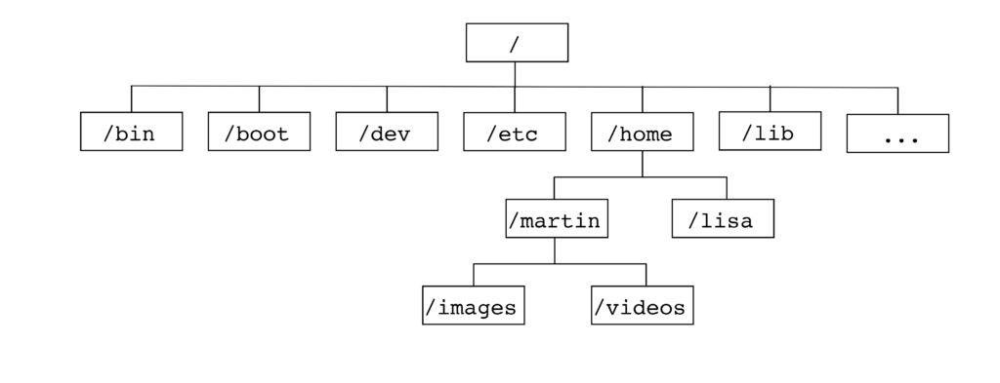

# Introduction

Although there are countless commands in Linux, some are absolutely essential to fully benefit from the system. Chances are, you'll use them every day.

## Foreword

We recommend not using AI to complete the exercises as you are currently in a learning phase.

## Prerequisites

* Have a virtual machine, a PC, or an environment running Linux (ideally Ubuntu)
* Be resilient XD

**Info:** If you don’t have access to a Linux environment, you can register at [https://killercoda.com](https://killercoda.com) and go here: [https://killercoda.com/playgrounds/scenario/ubuntu](https://killercoda.com/playgrounds/scenario/ubuntu) to access a virtual Ubuntu 24.04 machine (without a graphical interface, of course!!) for 1 hour, renewable for free.

You’ll see the following view:


<br>

**Bonus for the Killerkoda team 👨🏾‍💻👩🏾‍💻:**

* Open your terminal
* Run:

```bash
echo "export PS1='\[\e[01;31m\]\u@\h:\w# \[\e[00m\]'" >> .bashrc
source ~/.bashrc
```

You’ll now have this view:


# Discovering the Linux Terminal

When we talk about the Linux terminal, we’re referring mainly to the command prompt, the command interpreter (shell), and, of course, the commands.

Example of a Linux terminal:


1. The command prompt

   * It tells you who you are and where you are in the system. It may vary depending on the distro and configuration but often looks like this:
     Example: `user@machine:directory$`

     * `user`: Your username
     * `machine`: The hostname
     * `directory`: The current folder (e.g., `~` is your home directory)
     * `$`: Symbol for a regular user (`#` for root)

2. The shell (command interpreter)

   * The program that executes the commands you type. The most common is **Bash** (Bourne Again Shell), but others like **Zsh**, **Fish**, or **Tcsh** also exist.
   * It translates your instructions into actions for the system.

3. The commands

   * These are the instructions you type, like `ls`, `cd`, `cat`, or even `cowsay`, etc. They can be:

     * **Built-in**: Integrated into the shell (e.g., `cd` to change directory)
     * **External**: Separate programs (e.g., `ls` to list files)

# The Linux Filesystem Structure

The Linux filesystem is like a well-organized cabinet full of drawers and folders. It’s the way files and directories are structured in a Linux system. It all starts from a single point called the root, simply noted as `/`. From there, everything branches out like a tree (hence the term "filesystem tree").

Here are the main directories and their purposes:

* **bin/** : (binary) User programs
* **sbin/** : (super binary) Superuser programs
* **lib/** : (library) Libraries used by applications
* **etc/** : (et cetera) Application configurations
* **tmp/** : (temporary) Temporary directory accessible to all
* **var/** : (variable) Application data that varies in size (databases, web content, logs, etc.)
* **boot/** : (boot) Linux kernel loaded at startup
* **dev/** : (devices) Access to hardware devices
* **proc/** : (process) Virtual directory containing process and kernel info used by system commands
* **opt/** : (optional) Proprietary or non-standard software
* **root/** : Root user’s personal directory
* **home/** : User home directories where their files are stored
* **mnt/** : (mount points) Where devices are mounted

Here’s a small illustration:



<br>

**To try 👨🏾‍💻👩🏾‍💻:**

* Open your terminal
* Run:

  ```bash
  tree -d -L 1 /
  ```

# Comparing the Linux and Windows Filesystems (BONUS)

Let’s compare the Linux filesystem to Windows', like comparing two cabinets with different organizational logics.

### Linux: A unified filesystem (everything starts from `/`)

On Linux, everything starts at the **root** (`/`) and is organized into a single large structure. Each directory has a specific role:

* **/home**: User personal space
* **/bin**: Basic tools
* **/etc**: Configuration files
* etc.

It’s a **unified** system: no matter where Linux is installed or which disk you add, everything appears as part of the same tree. For instance, an external disk might be mounted under `/mnt` or `/media`.

### Windows: A drive letter–based structure

On Windows, there’s not a single root but multiple separate “cabinets,” identified by **letters** (C:, D:, etc.). Each letter represents a disk or partition, and the organization is less standardized. Key equivalents:

* **C:\Users**: Like `/home` in Linux, for user files
* **C:\Windows\System32**: Similar to `/bin` or `/usr/bin`, essential system files
* **C:\Windows**: Like `/etc`, for configuration (but all mixed in)
* **D:** etc.: An external drive or USB will get its own letter and filesystem

### Main Differences

1. **Single root vs multiple letters**

   * Linux: Everything is connected to `/`
   * Windows: Each drive is a separate “island” (C:, D:, etc.)
2. **Clear roles vs mixed files**

   * Linux: Everything is separated clearly (configs in `/etc`, binaries in `/bin`)
   * Windows: A lot gets lumped into `C:\Windows` or `C:\Program Files`
3. **Paths**

   * Linux: `/home/user/doc.txt`
   * Windows: `C:\Users\User\doc.txt` with backslashes (`\`)

### Concrete Example

Say you want to store a personal file:

* **On Linux**: It goes in `/home/your_name/my_docs`
* **On Windows**: It goes in `C:\Users\YourName\My Documents`

And if you plug in a USB drive:

* **On Linux**: It appears under `/media/your_name/usbdrive`
* **On Windows**: It becomes `E:` or another letter

### Summary

Linux is like a big library with one entry point and neatly labeled sections, while Windows is like several smaller libraries, each with its own shelving logic. See the difference? Let me know if you want to dive deeper into a particular aspect!

# Basic Commands

**Info:** If you’re used to working in a graphical interface, your goal here is to reproduce everything you know how to do graphically in the Linux terminal (create/move/copy/delete files/folders, create shortcuts, navigate directories, etc.)

## Navigation and File Management Commands

* **`pwd`**: Shows the full path of the current directory (e.g., `/home/user`)
* **`ls`**: Lists files and folders (may be `dir` on some distros, but `ls` is standard)

  * Useful options: `ls -l` (details), `ls -a` (hidden files)
* **`ln`**: Creates symbolic or hard links (e.g., `ln -s file.txt symlink`)
* **`cd`**: Change directory (e.g., `cd /var/www` or `cd ..` to go up)
* **`mkdir`**: Create a new folder (e.g., `mkdir new_folder`)
* **`rmdir`**: Remove an empty folder (e.g., `rmdir empty_folder`)
* **`touch`**: Create an empty file (e.g., `touch file.txt`)
* **`cp`**: Copy files or directories (e.g., `cp file.txt copy.txt`)
* **`mv`**: Move or rename files (e.g., `mv file.txt /other/path`)
* **`rm`**: Delete files or folders (e.g., `rm file.txt`, `rm -r folder`)
* **`tar`**: Archive or extract files (e.g., `tar -cvf archive.tar folder`, `tar -xvf archive.tar`)
* **`zip`**: Compress to ZIP format (e.g., `zip archive.zip file.txt`, `unzip archive.zip`)

## Display and Content Commands

* **`cat`**: Display a file’s contents (e.g., `cat file.txt`)
* **`less`**: View a file page by page (e.g., `less file.txt`, quit with `q`)
* **`more`**: Similar to `less`, but less flexible
* **`echo`**: Print text or variables (e.g., `echo "Hello"`)
* **`head`**: Show first lines of a file (e.g., `head -n 5 file.txt`)
* **`tail`**: Show last lines (e.g., `tail -n 5 file.txt`)
* **`nano`**: Simple terminal text editor (`nano file.txt`, save with `Ctrl+O`, quit with `Ctrl+X`)
* **`vi`**: Vi editor (`vi file.txt`, insert mode with `i`, save and quit with `:wq`)
* **`vim`**: Enhanced Vi (`vim file.txt`, same commands with extra features)
* **`which`**: Shows the path of a command (e.g., `which python`)

## Search and Filtering Commands

* **`find`**: Search for files or folders in a tree (e.g., `find /home -name "file.txt"`)
* **`grep`**: Search for a pattern (e.g., `grep "word" file.txt`, `ls | grep "doc"`)

## System Info Commands

* **`whoami`**: Show current user
* **`uname`**: Info about the system (e.g., `uname -a`)
* **`df`**: Show disk space (`df -h` for human-readable)
* **`du`**: Folder size (`du -sh folder`)
* **`top`**: Show running processes (like task manager)
* **`nproc`**: Number of processor cores

## Permissions Management Commands

* **`chmod`**: Change file permissions (e.g., `chmod +x script.sh`)
* **`chown`**: Change file owner (e.g., `chown user file.txt`)
* **`ls -l`**: Check permissions (e.g., `-rwxr-xr-x`)

## Network Commands

* **`ping`**: Test network connectivity (e.g., `ping google.com`)
* **`curl`**: Fetch data from a URL (`curl http://example.com`)
* **`wget`**: Download files from the web (`wget http://example.com/file`)

## Utility Commands

* **`man`**: Manual for a command (`man ls`)
* **`history`**: View past commands
* **`clear`**: Clear the terminal screen
* **`sudo`**: Run a command as admin (`sudo apt update`)
* **`exit`**: Close terminal or session
* **`alias`**: Create a shortcut for a command (`alias ll="ls -l"`)

## Redirections and Pipes

* **`>`**: Redirect output to a file (`echo "text" > file.txt`)
* **`>>`**: Append to a file (`echo "more" >> file.txt`)
* **`|`**: Pipe output from one command to another (`ls | grep "word"`)

Whew! That’s a lot of commands.
But you’ll memorize them with practice. Also, the **--help** option and the **man** command will be your best friends for learning how to use a command.

<br>

**To try 👨🏾‍💻👩🏾‍💻:**

* Open your terminal
* Run:

  ```bash
  cp --help  
  man find
  ```

# Practice ⚔️

## Exercise 1

* Complete at least the first 10 challenges: [https://cmdchallenge.com/](https://cmdchallenge.com/)

## Exercise 2

This section's exercises are in the form of challenges. There are five, each accessible via a script you must run to begin.

* Challenge 1: [https://raw.githubusercontent.com/N0vachr0n0/NoFD/refs/heads/main/BC\_EXO\_1.sh](https://raw.githubusercontent.com/N0vachr0n0/NoFD/refs/heads/main/BC_EXO_1.sh)
* Challenge 2: [https://raw.githubusercontent.com/N0vachr0n0/NoFD/refs/heads/main/BC\_EXO\_2.sh](https://raw.githubusercontent.com/N0vachr0n0/NoFD/refs/heads/main/BC_EXO_2.sh)
* Challenge 3: [https://raw.githubusercontent.com/N0vachr0n0/NoFD/refs/heads/main/BC\_EXO\_3.sh](https://raw.githubusercontent.com/N0vachr0n0/NoFD/refs/heads/main/BC_EXO_3.sh)
* Challenge 4: [https://raw.githubusercontent.com/N0vachr0n0/NoFD/refs/heads/main/BC\_EXO\_4.sh](https://raw.githubusercontent.com/N0vachr0n0/NoFD/refs/heads/main/BC_EXO_4.sh)
* Challenge 5: [https://raw.githubusercontent.com/N0vachr0n0/NoFD/refs/heads/main/BC\_EXO\_5.sh](https://raw.githubusercontent.com/N0vachr0n0/NoFD/refs/heads/main/BC_EXO_5.sh)

Example of usage:

```bash
# Download the script for Challenge 1
curl -LO https://raw.githubusercontent.com/N0vachr0n0/NoFD/refs/heads/main/BC_EXO_1.sh

# Make it executable
chmod +x BC_EXO_1.sh

# Run it to start the challenge
./BC_EXO_1.sh
```

## Exercise 3 (Deep dive)

* Complete this challenge: [https://sadservers.com/scenario/saskatoon](https://sadservers.com/scenario/saskatoon)

## Exercise 4 (Bonus)

To learn and get comfortable with the **vim** text editor, we recommend using **vimtutor**.
Open your terminal and type **vimtutor**. You'll see something like this:


---
---

## Feedback

> ENG: Please give us your feedback about this chapter.

> FR: Faites-nous part de votre avis sur ce chapitre.

> 👉🏾 https://forms.gle/1oYNEGehhKUCMcoP7 
