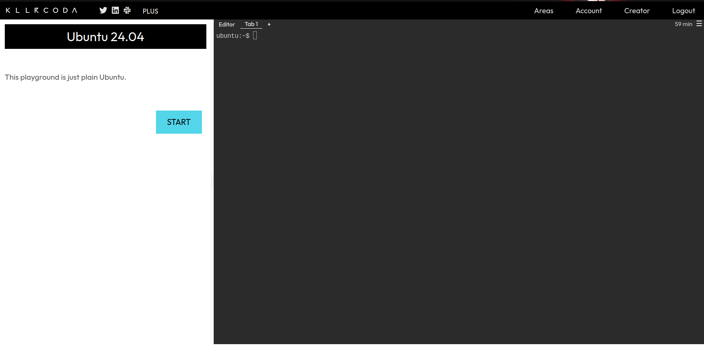

# Introduction

In a Linux system, process management is a fundamental aspect of system administration and application operation. A process is simply a running program. Linux, like all modern operating systems, uses processes to execute tasks and organize work.

## Foreword

We recommend not using AI to do the exercises as you are in a learning phase.

## Prerequisites (Repetition is pedagogical XD)

* Have a virtual machine or a PC or an environment under Linux (Ubuntu ideally)
* Be resilient XD

**Info:** If you don't have a Linux environment available, you can register on https://killercoda.com and go to https://killercoda.com/playgrounds/scenario/ubuntu to get access to a virtual machine under Ubuntu 24.04 (without a graphical interface, of course!!) for 1 hour, renewable for free.

You will then have this view:



# Generalities

A process is an instance of a running program. It can be as simple as a command launched in the terminal or as complex as a background application. Each process has its own memory space, its own unique identifier (PID), and information related to its execution status. If process 2 was launched by process 1, it is called a **child process**. The process that launched it is called the **parent process**.

<br>
There are different types of processes in Linux:

* **Interactive processes**: These are processes launched by a user directly via a terminal or a graphical interface. For example, launching a text editor or a web browser.

* **Background processes (daemon)**: These are processes that run without direct user interaction, often used for system services, such as a web server (Apache, for example).

* **Zombie processes**: These are processes that have finished execution but whose information remains in the process table because their parent has not yet retrieved their exit status.

## TLDR (Quick Summary)

* A process is an instance of a running program.
* Each process has:
    * a **PID**: Process IDentifier, unique process identifier;
    * a **PPID**: Parent Process IDentifier, unique parent process identifier.
* Types of processes: interactive, background, and zombie

## Let's Type a Bit

**To test 👨🏾‍💻👩🏾‍💻:**
- Open your terminal
- Execute:
  ```bash
  ps
````

\<br\>

For your information, **ps** stands for **p**rocess **s**tatus. It allows us to display running processes.
You will get a similar output to:

```
PID     TTY        TIME CMD
380123  pts/3      00:00:00 bash
427931  pts/3      00:00:00 ps
```

Below is an explanatory table.

| Column | Meaning | Example |
|---|---|---|
| **PID** | Unique identifier assigned by Linux to each process. | `bash`: **380123**\<br\>`ps`: **427931** |
| **TTY** | Terminal to which the process is attached. `pts/*` are pseudo-terminals, often opened during an SSH connection or a graphical terminal. | `pts/3` |
| **TIME** | CPU time used by the process since its launch. | `00:00:00` (minimal time for fast or idle processes) |
| **CMD** | Command or program that initiated the process. | `bash` (interactive shell)\<br\>`ps` (process display command) |

\<br\>

From this result, we might ask two (2) questions:

  * Why does **ps** display itself?
  * Why don't we see all system processes after typing **ps**?

<!-- end list -->

1.  The `ps` command is itself a Linux process. When executed, it temporarily creates itself as a process, then it analyzes the processes running at that precise moment. Thus, it naturally appears in its own results.

2.  By default, this command (**ps**) without specific arguments displays only the processes associated with its current terminal. This explains why we only see the shell (bash) we are currently using, as well as the `ps` command itself.

\<br\>

**To test 👨🏾‍💻👩🏾‍💻:**

  - Open your terminal
  - Execute:
    ```bash
    ps
    echo 'foo' > myfile.txt
    tail -f myfile.txt & #To run the task in the background
    jobs #To view background tasks
    ps
    ```

# Process Management

## Commands to display running processes:

  - **In real-time:** `top`
  - **At a given moment:** `ps`
      - `-e`: all processes
      - `-f`: detailed display

**Practical examples:**

  - List all processes with details: `ps -ef`
  - List processes in a tree format: `ps -faux`
  - Check if the apache process is running: `ps -ef | grep httpd`
  - Gracefully stop process `123` (SIGTERM signal): `kill 123`
  - Force immediate stop of process `123` (SIGKILL signal): `kill -9 123`

\<br\>

**Reminder:** The **man** command and the **--help** option are your best friends.

\<br\>

## Other Commands

### The pgrep and pkill commands

The **pgrep** command searches among running processes for a process name and displays the corresponding PIDs on standard output based on the selection criteria.

The **pkill** command will send the indicated signal (default **SIGTERM**) to each process matching the specified criteria.

**Syntax:**

  - `pgrep process`
  - `pkill [-signal] process`

**Examples:**

  - Retrieve the process number of **sshd** for the root user:
    ```bash
    pgrep -u root sshd
    ```
  - Kill all tomcat processes:
    ```bash
    pkill tomcat
    ```

# Training ⚔️

## Exercise 1

  * Challenge script link: https://raw.githubusercontent.com/N0vachr0n0/NoFD/refs/heads/main/PRM\_EXO\_1.sh

Below is an example of execution:

```bash
# Download the challenge 1 script
curl -LO [https://raw.githubusercontent.com/N0vachr0n0/NoFD/refs/heads/main/PRM_EXO_1.sh](https://raw.githubusercontent.com/N0vachr0n0/NoFD/refs/heads/main/PRM_EXO_1.sh)

# Make it executable
chmod +x PRM_EXO_1.sh

# Execute it to start the challenge
./PRM_EXO_1.sh
```

## Exercise 2

It's over here: https://sadservers.com/scenario/saint-john

---
---

## Feedback

ENG: Please give us your feedback about this chapter.
FR: Faites-nous part de votre avis sur ce chapitre.

👉🏾  https://forms.gle/dNjUFEXf6saN8RTEA

