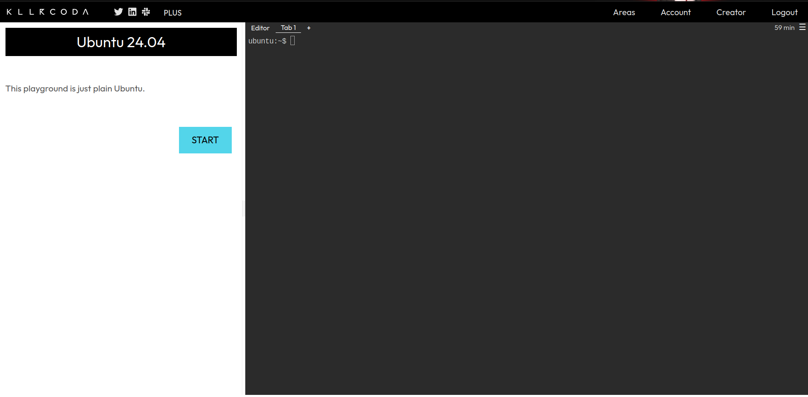
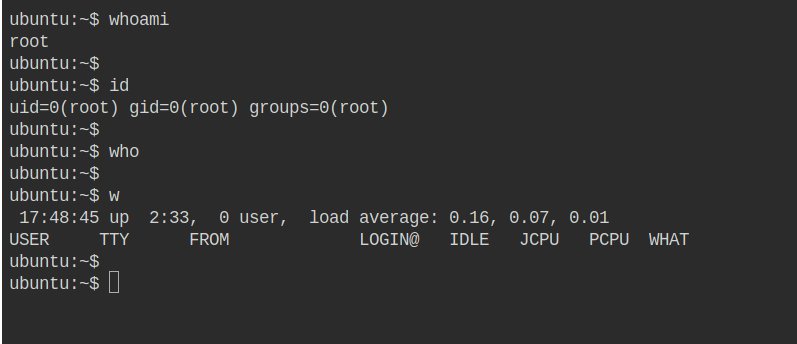
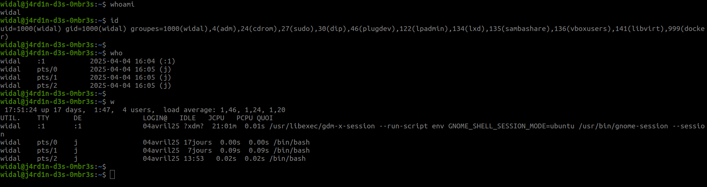

# Introduction

Linux is a true multi-user system! Multiple users can log in and perform tasks simultaneously. It also has a single-user mode managed by the kernel, used solely for maintenance purposes. Users typically have:
* a login and password
* a system identifier (userid or uid)
* a primary group, secondary groups
* a home directory, files, data
* running processes

## Foreword

We recommend that you do not use AI to complete the exercises, as you are in the learning phase.

## Prerequisites (Repetition is pedagogical XD)

* Have a virtual machine, a PC, or an environment running Linux (Ubuntu ideally)
* Be resilient XD

**Info:** If you do not have a Linux environment available, you can sign up at https://killercoda.com and go to https://killercoda.com/playgrounds/scenario/ubuntu to access a virtual machine running Ubuntu 24.04 (without a graphical interface, of course!) for 1 hour, renewable for free.

You will then see this view:



# User Management

## Intro

**To try 👨🏾‍💻👩🏾‍💻:**
- Open your terminal
- Execute (line by line):
  ```bash
  whoami
  id
  who
  w
  ```

Below is an example of similar output you will get:


<br>


A quick explanation.

### Command: `whoami`

```bash
widal@j4rd1n-d3s-0mbr3s:~$ whoami
widal
```

- Displays the **name of the logged-in user**.
- Result here: `widal`

---

### Command: `id`

```bash
widal@j4rd1n-d3s-0mbr3s:~$ id
uid=1000(widal) gid=1000(widal) groups=1000(widal),4(adm),24(cdrom),27(sudo),30(dip),46(plugdev),122(lpadmin),134(lxd),135(sambashare),136(vboxusers),141(libvirt),999(docker)
```

- Displays the **user’s identity** and their **groups**:
  - `uid=1000` → User ID
  - `gid=1000` → Primary group ID
  - `groups=...` → Secondary groups (e.g., `sudo`, `docker`, `plugdev`, etc.)

---

### Command: `who`

```bash
widal@j4rd1n-d3s-0mbr3s:~$ who
widal    :1           2025-04-04 16:04 (:1)
widal    pts/0        2025-04-04 16:05 (j)
widal    pts/1        2025-04-04 16:05 (j)
widal    pts/2        2025-04-04 16:05 (j)
```

- Shows **who is logged in** to the system.
- `:1` → graphical session (interface)
- `pts/0`, `pts/1`, `pts/2` → open terminals (e.g., via terminal or SSH)

---

### Command: `w`

```bash
widal@j4rd1n-d3s-0mbr3s:~$ w
 17:51:24 up 17 days,  1:47,  4 users,  load average: 1,46, 1,24, 1,20
USER     TTY      FROM             LOGIN@   IDLE   JCPU   PCPU WHAT
widal    :1       :1               04apr25 ?xdm?  21:01m  0.01s /usr/libexec/gdm-x-session ...
widal    pts/0    j                04apr25 17days  0.00s  0.00s /bin/bash
widal    pts/1    j                04apr25  7days  0.09s  0.09s /bin/bash
widal    pts/2    j                04apr25 13:53   0.02s  0.02s /bin/bash
```

- **System summary**:
  - System up for **17 days**
  - **4 users** connected (each open terminal and the graphical interface count as a user)
  - **Load average** (1, 5, 15 min): `1.46`, `1.24`, `1.20`

- **Columns**:
  - `USER`: Username
  - `TTY`: Terminal used
  - `LOGIN@`: Login time/date
  - `IDLE`: Idle time
  - `JCPU`: Total CPU time used by the user
  - `PCPU`: CPU time of the active process
  - `WHAT`: Current process/command

## What is the `/etc/passwd` File?

* The `/etc/passwd` file lists all system users and their associated information.
    * Common to all distributions
    * Generally readable by all (but restricted for writing)
* One line per declared user:
login:password:uid:gid:comment:home_directory:shell
* Example:
```
djo:x:15:15:Djo Dalton:/home/djo:/bin/bash
```
* The root user always has uid 0!
* What does the `x` in the line mean?
    ```
    djo:x:15:15:Djo Dalton:/home/djo:/bin/bash
    ```
    * It indicates that the password is stored in **/etc/shadow**
        * Likely encrypted
        * Likely "salted"
* A user’s password is generally set using the **passwd** command

**To try 👨🏾‍💻👩🏾‍💻:**
- Open your terminal
- Execute (line by line):
    ```bash
    cat /etc/passwd
    ```

<br>

🔁🃏 **UNO Reverse!!!**

<br>

* The **/etc/shadow** file contains user security information (separated by :).
* Line format in **/etc/shadow**:
login:encrypted_password:last_change:min_age:max_age:warning_time:inactivity_time:expiration_date:reserved
* Example:
```
djo:$y$j9T$3J4GSvuGv7bM4Vn4BRaOm1$3nuzvVPg0VJoidAVUKsMJvf2Hn3Q6.TbC0H5MnqA782:15051:0:99999:7:::
```
    * Password hashed with MD5 and salted
    * Password unchanged for 15051 days (since 01/01/1970)
    * No minimum age (0)
    * Maximum age of 99999 days before expiration
    * 7 days before expiration, the user will be warned
* ⚠️ It is not recommended to directly modify the **/etc/passwd** and **/etc/shadow** files to avoid typos that could make authentication impossible

**To try 👨🏾‍💻👩🏾‍💻:**
- Open your terminal
- Execute (line by line):
  ```bash
  cat /etc/shadow
  ```

## User Management Commands

### Points to Note ⚠️
* Only the **root** user (the superuser/administrator) can use user and group management commands.

* A regular user must have admin privileges. To do this, you need to use the **sudo** command when executing a user management command. When using **sudo**, you will be prompted to enter your password.

Below is an example situation:

```
widal@j4rd1n-d3s-0mbr3s:~$ whoami
widal
widal@j4rd1n-d3s-0mbr3s:~$ useradd avrell
useradd: Permission denied.
useradd: cannot lock /etc/passwd; try again later.
widal@j4rd1n-d3s-0mbr3s:~$ sudo useradd avrell
[sudo] password for widal:
widal@j4rd1n-d3s-0mbr3s:~$ id avrell
uid=1002(avrell) gid=1002(avrell) groups=1002(avrell)
widal@j4rd1n-d3s-0mbr3s:~$ 
widal@j4rd1n-d3s-0mbr3s:~$ echo "user avrell is there"
user avrell is there
widal@j4rd1n-d3s-0mbr3s:~$ 
```

<br>

### 1. `useradd` – Add a New User

```bash
sudo useradd username
```

- Creates a **new user**.
- ⚠️ By default, **does not create the home directory** (`/home/username`) without an option.

#### Example:
```bash
sudo useradd -m alice
```
- Creates the user `alice`
- The `/home/alice` directory is created with the `-m` option.

---

### 2. `usermod` – Modify an Existing User

```bash
sudo usermod [options] username
```

- Used to **change user information**: group, directory, shell, etc.

#### Examples:
```bash
sudo usermod -aG sudo alice
```
➡️ Adds `alice` to the `sudo` group.

```bash
sudo usermod -d /new/path alice
```
➡️ Changes the home directory for `alice`.

---

### 3. `passwd` – Change a User’s Password

```bash
sudo passwd username
```

- Allows you to **set or change** a user’s password.

#### Example:
```bash
sudo passwd alice
```
➡️ Prompts for a new password for `alice`.

---

### 4. `userdel` – Delete a User

```bash
sudo userdel username
```

- Deletes the user **without deleting their home directory**.

#### Example:
```bash
sudo userdel alice
```

#### Delete their directory as well:
```bash
sudo userdel -r alice
```

---

### `adduser` vs `useradd`

| Command   | Description |
|-----------|-------------|
| `useradd` | **Low-level command**: simple, but requires more options. |
| `adduser` | **Interactive script**: guides step-by-step (password, info, etc.) |
|           | Automatically creates the home directory, shell, etc. |

#### Example:
```bash
sudo adduser bob
```
➡️ Starts an assistant to create a complete user.

---

### TLDR (Quick Summary)

| Command     | Role                              |
|-------------|-----------------------------------|
| `useradd`   | Create a user (simple)           |
| `adduser`   | Create a user (assisted)         |
| `usermod`   | Modify an existing user          |
| `passwd`    | Change the password              |
| `userdel`   | Delete a user                    |

### Commands for Switching Users

- **su**: Switches to another user or opens a root session (e.g., `su user` to switch to another user, or `su` to become root).  
  - Useful options: `su - user` (loads the target user’s environment, as if it were a new login).
- **sudo**: Executes a command as another user, typically root (e.g., `sudo command` to run `command` with root privileges).  
  - Useful options: `sudo -u user command` (runs the command as a specific user).
- **whoami**: Displays the current user (e.g., `whoami` returns the name of the active user, useful for verifying after a switch).

<br>

## Exercise ⚔️

* Link to the challenge script: https://raw.githubusercontent.com/N0vachr0n0/NoFD/refs/heads/main/USER_EXO_1.sh

Below is an example execution:

```
# Download the challenge script
curl -LO https://raw.githubusercontent.com/N0vachr0n0/NoFD/refs/heads/main/USER_EXO_1.sh

# Make it executable
chmod +x USER_EXO_1.sh

# Run it to start the challenge
./USER_EXO_1.sh
```

# Group Management

## Intro

* A group is a set of users with common characteristics
    * Same permissions on certain files
    * Same applications used
    * User classification
    * etc.
* Each user has a primary group, assigned during their creation, which allows them to assign that group to the files they create. This primary group often has the same name as the user.
* A group generally has:
    * A system ID (group id)
    * A group name
    * A group password
    * A list of users who are part of the group

**To try 👨🏾‍💻👩🏾‍💻:**
- Open your terminal
- Execute (line by line):
    ```bash
    groups # To see your group(s) membership
    id # To see your primary group and secondary groups
    ```

* The **/etc/group** file lists all system groups and their associated information
    * Like **/etc/passwd**, it is common to all distributions
    * It is also a publicly readable file
* Format of **/etc/group**:
```
groupname:grouppassword:gid:user_list
```

   * Example:
    ```
    admins:x:10:djo,jack,william,avrell
    ```
* Like for users, the root group always has gid 0!

**To try 👨🏾‍💻👩🏾‍💻:**
- Open your terminal
- Execute:
    ```bash
    cat /etc/group
    ```

The **x** you see here again represents the group password. It is stored in **/etc/gshadow**, and like for users in **/etc/shadow**:

* Like **/etc/shadow**, **/etc/gshadow** should not be freely accessible (Info: infiltrating the root group is dangerous!)
* Line format in **/etc/gshadow**:
```
group_name:encrypted_password:group_admins:group_members
```
   * Example:
    ```
    daemon:$1$bmONNXPt$wRx7Xkxag20WhcT/kBc3p0::root,bin,daemon
    ```
        * Daemon group
        * Password hashed with MD5 and salted
        * root, bin, and daemon can assume this primary group without needing a password
* It is not recommended to directly modify the **/etc/group** or **/etc/gshadow** files

## The `sudo` or `wheel` Group

* In the Linux world, the **sudo** and **wheel** groups allow a regular user to use administrator privileges. In other words, the privileges of the **root** user. **sudo** and **wheel** are privileged groups. They are also called **sudoers groups**.

* **sudo**, in addition to being a group, is primarily a package/command that allows a regular user to run a command/application as an administrator (root). Think of "Run As Administrator" on Windows.

## Group Management Commands

⚠️ Don’t forget the points to note ⚠️

- **groupadd**: Creates a new group (e.g., `groupadd group_name` to add a group named `group_name`).
- **groupdel**: Deletes a group (e.g., `groupdel group_name` to delete the group `group_name`).
- **groupmod**: Modifies a group’s attributes (e.g., `groupmod -n new_name old_name` to rename a group).
- **usermod**: Modifies a user’s group membership.  
  - Useful options: `usermod -g primary_group user` (changes the primary group), `usermod -aG secondary_group user` (adds the user to a secondary group without removing others).
- **gpasswd**: Manages group passwords and members (e.g., `gpasswd -a user group` to add a user, or `gpasswd -d user group` to remove a user).
- **getent**: Displays group information (e.g., `getent group group_name` to view group details, such as members).
- **groups**: Lists the groups a user belongs to (e.g., `groups user` to display the groups of the specified user, or `groups` for the current user).

## Managing the `/etc/sudoers` File

The `/etc/sudoers` file is a configuration file used on Linux/Unix systems to define permissions for users and groups regarding the use of the `sudo` command. It determines who can execute commands as an administrator (root) or another user, and which specific commands they can run. This file is critical for security, as a misconfiguration can either block legitimate access or grant excessive privileges.

- **Location**: `/etc/sudoers` (main file).
- **Format**: Contains rules in the form `user host = (target_user) commands`.
- **Example line**: `user ALL=(ALL) ALL` means that `user` can execute all commands on all hosts as any user.

The `sudoers` file should **never** be edited directly with a standard editor (like `nano` or `vim`), as a syntax error could block access to `sudo`. The recommended method is to use the **visudo** command, which checks the syntax before saving.

   ```bash
   sudo visudo
   ```
Below are some example lines.

| Line                                   | Meaning |
|----------------------------------------|---------|
| `jean ALL=(ALL) /usr/bin/apt, /usr/bin/systemctl` | The user `jean` is allowed to execute only the `/usr/bin/apt` and `/usr/bin/systemctl` commands as root or any other user, from any host. |
| `jean ALL=(ALL) NOPASSWD: ALL`         | The user `jean` can execute **all** commands as any user without entering a password. |
| `jean ALL=(ALL) ALL`                   | The user `jean` can execute **all** commands as any user but must enter their password. |
| `%admins ALL=(ALL) ALL`                | All members of the `admins` group can execute **all** commands as any user, with a password required. (Note the **%**) |

To wrap up, I invite you to research:
```
sudo -l
```

## Exercise ⚔️

Execute the script to start the challenge like a pro 😉.

* Link to the challenge script: https://raw.githubusercontent.com/N0vachr0n0/NoFD/refs/heads/main/USER_EXO_1.sh

---
---

## Feedback

ENG: Please give us your feedback about this chapter.
FR: Faites-nous part de votre avis sur ce chapitre.

👉🏾 https://forms.gle/RJzHyDZMpwDDS2uc7
