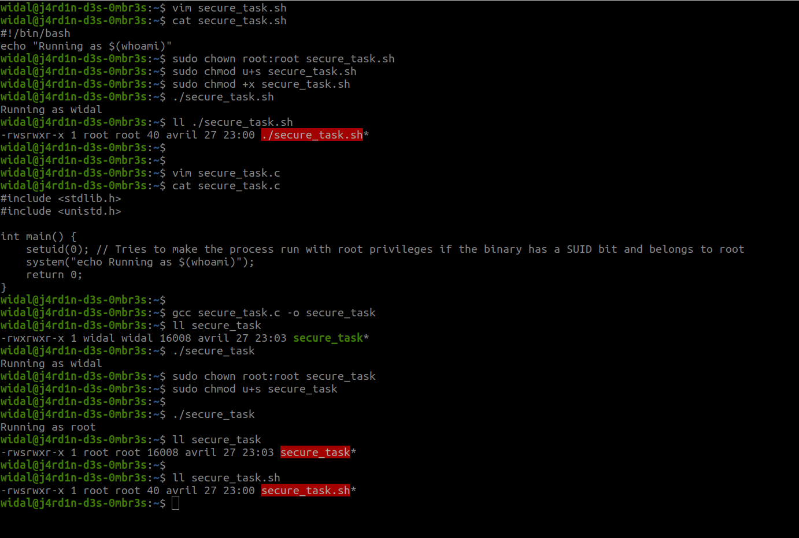

# Introduction

In this section, we will cover file management in Linux. More specifically, we will discuss permissions and access management for files.

## Foreword (Repetition is pedagogical XD)

We recommend that you do not use AI to complete the exercises, as you are in the learning phase.

## Prerequisites

Same old story. 😉

# File Management

## File Permissions
### General Concepts

In Linux, file permissions are an essential barrier against unauthorized access.

* File permissions restrict 3 actions:
    * Reading the file (denoted by the letter **r**)
    * Writing or modifying the file (**w**)
    * Executing (binary, shell script, etc.) (**x**)

* Each of these 3 actions can be assigned to 3 types of users:
    * The file owner (**u**)
    * Any user in the file’s group (**g**)
    * Others (neither the owner nor part of the file’s group) (**o**)

These permissions can be viewed using the `ls -l` command, which displays them in the following symbolic format:

```
-rw-rw-r-- 1 widal widal 244 April 23 01:48 pubspec.yaml
```

Let’s break down each part of this line:

1. **`-rw-rw-r--`**: These are the file’s permissions.
   - The first character (`-`) indicates that this is a **regular file** (as opposed to a directory or symbolic link, for example). Below are all file types with their respective characters:

            `-`: regular file
            `d`: directory
            `c`: character device
            `b`: block device
            `l`: symbolic link
            `p`: named pipe (IPC)
            `s`: local socket (IPC)

   - The first three characters (`rw-`) indicate the permissions for the **owner** of the file (here, "widal"). The owner can read and write the file but cannot execute it.
   - The next three characters (`rw-`) indicate the permissions for the **group** of the file. The "widal" group can also read and write the file but cannot execute it.
   - The last three characters (`r--`) indicate the permissions for **other users** (those who are neither the owner nor part of the group). These users can only read the file but cannot write or execute it.

2. **`1`**: This indicates the number of hard links (i.e., the number of filenames pointing to this file) in the system. Typically, for a simple file, this is 1.

3. **`widal`**: The name of the **owner** of the file, here "widal".

4. **`widal`**: The name of the **group** associated with the file. Here, too, the group is "widal".

5. **`244`**: The file size in bytes. This file weighs 244 bytes.

6. **`April 23 01:48`**: The **date and time** of the last file modification. Here, the file was modified on April 23 at 01:48.

7. **`pubspec.yaml`**: The **name of the file**.

#### Summary:
The file `pubspec.yaml` belongs to the user "widal" and the group "widal". It is readable and writable by both entities but only readable by others. It is 244 bytes in size and was last modified on April 23 at 01:48.

### Changing File Permissions

In Linux, file and directory permissions define who can read, write, or execute a file. You can change these permissions with the `chmod` command. Permission changes can be done in two main ways: using **numbers** or **symbols**.

#### 1. **Using Numbers for `chmod`**

Each type of permission (read, write, execute) is represented by a number:
- **Read** (`r`) = 4
- **Write** (`w`) = 2
- **Execute** (`x`) = 1

Permissions are assigned by a three-digit number representing the permissions for the **owner**, **group**, and **other users**.

- The first digit is for the owner.
- The second digit is for the group.
- The third digit is for other users.

Examples:
- `chmod 755 file.txt`: The owner has all permissions (`7` = `rwx`; breakdown: `7` = `r(4) + w(2) + x(1)`), the group has read and execute permissions (`5` = `r-x`), and others have read and execute permissions (`5` = `r-x`).
- `chmod 644 file.txt`: The owner has read and write permissions (`6` = `rw-`), and others have read-only permissions (`4` = `r--`).

#### 2. **Using Symbols for `chmod`**

You can also specify permissions using symbols:
- `+`: Add a permission.
- `-`: Remove a permission.
- `=`: Explicitly set permissions.

Examples:
- `chmod u+x file.txt`: Adds execute permission for the **owner** (`u` = user).
- `chmod g-w file.txt`: Removes write permission for the **group** (`g` = group).
- `chmod o=r file.txt`: Sets the permissions for other users to "read only" (`o` = others).

#### 3. **Using `umask`** (ℹ️ Good to know!)

The `umask` command determines the default permissions for files and directories when they are created. The `umask` is a kind of "mask" that **removes** certain permissions from newly created files. By default, when a file is created, it has broad permissions (like `777` for a directory or `666` for a file), and the `umask` adjusts these permissions based on the specified values.

The `umask` command can be used to display or change the default permission mask.

- For example, if `umask` is set to `022`, it means new files will have default permissions of `644` (i.e., other users cannot write to the file).
- If `umask` is set to `0777`, all files will have highly restrictive permissions.

Example:
- `umask 0022`: For a file, the permissions will be `644` (owner: `rw-`, group and others: `r--`).
- `umask 0777`: For a file, the permissions will be `000`, preventing any access to the file.

#### 4. **`cp -p`**

The `cp` command is used to copy files or directories. The `-p` option of `cp` allows you to **preserve** the source file’s attributes during copying, such as:
- Permissions.
- Owner.
- Modification date.

Example:
```bash
cp -p source_file.txt copy_file.txt
```
This creates a copy of the file while maintaining the same permissions and other metadata as the original file.

---

### Table of Permissions and `chmod` Values

| Permission | Numeric Value | Description       | Associated Symbols |
|------------|---------------|-------------------|--------------------|
| **Read** (`r`)  | 4             | Read the file     | `r`                |
| **Write** (`w`)  | 2             | Modify the file   | `w`                |
| **Execute** (`x`) | 1             | Execute the file  | `x`                |
| **None**           | 0             | No permission     |                    |

| Numeric Value | Owner (u) | Group (g) | Others (o) | Example Command |
|---------------|-----------|-----------|------------|----------------|
| 7 (rwx)       | read, write, execute | read, write, execute | read, write, execute | `chmod 777 file.txt` |
| 6 (rw-)       | read, write | read, write | read       | `chmod 644 file.txt` |
| 5 (r-x)       | read, execute | read, execute | read     | `chmod 755 file.txt` |
| 4 (r--)       | read        | read        | read       | `chmod 444 file.txt` |
| 0 (---)       | No rights   | No rights   | No rights  | `chmod 000 file.txt` |

---

### Practical Example

Imagine you have a file `script.sh` with the following permissions:

```bash
-rw-r--r-- 1 user group 1000 April 23 01:48 script.sh
```

If you want to give execute permissions to all users, you can do:

```bash
chmod +x script.sh
```

This will modify the permissions to grant execution:

```bash
-rwxr-xr-x 1 user group 1000 April 23 01:48 script.sh
```

You can also use `cp -p` to copy a file while preserving its permissions and owner:

```bash
cp -p script.sh /path/to/new_script.sh
```

This will keep the same metadata and permissions in the copy.

## Managing File Owners and Groups

* Every file has a single owner and a single group.
* Generally, the initial file owner is the user associated with the process that created the file.
* The initial file group is the primary group of the user associated with the process that created the file.

Below is a table showing how file owners and groups are managed.

| **Command**                               | **Description**                                      |
|--------------------------------------------|------------------------------------------------------|
| `chown alice file.txt`                    | Changes the file owner to `alice`.                   |
| `chown alice:dev file.txt`                | Changes the owner to `alice` and the group to `dev`. |
| `chown -R alice:dev /path/to/directory`   | Recursively changes the owner and group in a directory. |
| `chgrp dev file.txt`                      | Changes the file group to `dev`.                     |
| `chgrp -R dev /path/to/directory`         | Recursively changes the group in a directory.        |
| `ls -l file.txt`                          | Displays the permissions, owner, and group of the file. |

## The Sticky Bit (ℹ️ Good to know!)

The **sticky bit** is a special permission that can be set on a directory. When enabled, this bit modifies the behavior of files placed in that directory. It essentially **restricts file deletion** to the file’s owner. In other words, **only the file’s owner or the administrator (root)** can delete or rename the file in a directory marked with the sticky bit, even if other users have write permissions on the directory.

### Purpose of the Sticky Bit

The sticky bit is often used in shared directories, such as `/tmp`, where many users can create and modify files, but it’s critical to prevent users from deleting files created by other users in this directory.

**Typical use case**:
- **The `/tmp` directory**: This is a directory used by the system and users to store temporary files. The sticky bit is commonly set on this directory to prevent users from deleting files created by other users in this directory.

### How to Set and Check the Sticky Bit?

#### 1. **Setting the Sticky Bit**

To set the sticky bit, use the `chmod` command with the **`+t`** option. This is typically done on directories. For example:

```bash
chmod +t /tmp
```

This command adds the sticky bit to the `/tmp` directory. To verify that the sticky bit is enabled, you can use the `ls -l` command to display the directory’s permissions:

```bash
ls -ld /tmp
```

The output might look like this:

```bash
drwxrwxrwt 10 root root 4096 April 23 10:00 /tmp
```

Here, the `t` in the **permissions `rwxrwxrwt`** (instead of `x` at the end) indicates that the sticky bit is enabled.

#### 2. **Removing the Sticky Bit**

If you want to remove the sticky bit from a directory, you can use the following command:

```bash
chmod -t /tmp
```

This removes the sticky bit, allowing users with write permissions on the directory to delete or modify files belonging to other users.

### Behavior of the Sticky Bit

- **With sticky bit**: If the sticky bit is enabled on a directory, only the file owner, the directory owner, or the root user can delete or rename files. Other users with write permissions on the directory cannot affect files owned by others.
  
- **Without sticky bit**: If the sticky bit is not enabled, all users with write permissions on the directory can delete or rename files belonging to other users.

## SETUID and SETGID

The **SETUID** (Set User ID) and **SETGID** (Set Group ID) are special bits that can be set on executable files in Linux. When enabled, these bits modify how the system handles the execution of files. Their primary purpose is to temporarily grant permissions during the execution of a program, allowing a user to execute a file with the permissions of another user (typically a privileged user, like root).

### SETUID (Set User ID)
- **Purpose**: Allows a user to execute a file with the **permissions of the file’s owner**, not the user running the file.
- **Use case**: Often used for programs requiring elevated privileges to perform a specific task, such as `passwd` (changing a password), which must be executed with root privileges, even if the user running it is not root.

#### Example:
```bash
chmod u+s /path/to/file
```
This adds the **SETUID** bit to an executable file.

**Important note:** Modern Linux systems do not allow SETUID on shell scripts (e.g., .sh files) for security reasons. The script will execute with the permissions of the current user, not the owner (root), even if the SETUID bit is enabled.

<br>

**To try 👨🏾‍💻👩🏾‍💻:**
- Open your terminal
- Execute:
    ```bash
    $ ls -l /usr/bin/passwd ## You will see the 's' representing the SETUID bit in the user section. This binary file belongs to root, but anyone can execute it as root.

    $ passwd ## This allows you to change your password without using 'sudo', thanks to the SETUID bit.
    ```
<br>

### SETGID (Set Group ID)
- **Purpose**: Allows a user to execute a file with the **permissions of the file’s group**, rather than the permissions of the user’s group running the file.
- **Use case**: Very useful for programs or shared directories where maintaining specific group permissions is important.

#### Example:
```bash
chmod g+s /path/to/file
```
This adds the **SETGID** bit to an executable file or directory.

### In Summary:
- **SETUID**: Allows execution of a file with the **permissions of the file’s owner** (often root).
- **SETGID**: Allows execution of a file with the **permissions of the file’s group**.

These two bits are mainly used for managing temporary permissions during program execution and must be used cautiously to avoid security issues.

**Important note:** Modern Linux systems do not allow SETUID and SETGID on shell scripts (e.g., .sh files) for security reasons. The script will execute with the permissions of the current user, not those of the owner (root), even if the SETUID bit is enabled. See the image below.



# Practice ⚔️
## Exercise 1
* Research:
    * setfacl
    * getfacl
    * inodes (in the context of Linux, of course!)

## Exercise 2 (🧪)

Execute the script to start the challenge like a pro 😉.

* Link to the challenge script: https://raw.githubusercontent.com/N0vachr0n0/NoFD/refs/heads/main/FilesPerms_EXO_1.sh

## Exercise 3 (Deep Dive)

* Complete this challenge: https://sadservers.com/scenario/yokohama

---
---

## Feedback

> ENG: Please give us your feedback about this chapter.

> FR: Faites-nous part de votre avis sur ce chapitre.

> 👉🏾 https://forms.gle/1oYNEGehhKUCMcoP7 
