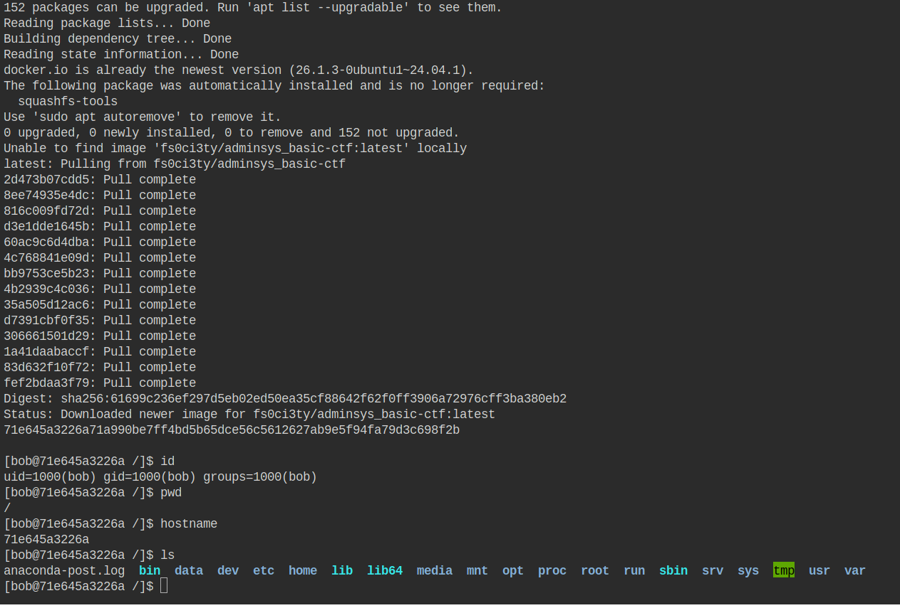

# Introduction

You will often need to install software that is not provided with your distribution or remove unwanted software to save disk space. In this section, we will cover package management for software and applications on Linux.

## Foreword (Repetition is pedagogical XD)

We recommend not using AI to complete the exercises as you are in a learning phase.

## Prerequisites

Same old story. 😉

# Package Managers in Linux

First, a package is an archive containing a set of files and directories to be deployed on the operating system in order to allow proper functioning of an installed application. A package may require the presence of other packages to work. These are called **dependencies**.

## Linux Repositories (repo or repository)

A Linux repository is a place (often online) where software packages are stored, ready to be downloaded and installed. You can also think of repositories as well-organized supermarkets or warehouses where you can find all those packages. XD

On Linux, there are several types of repositories:

* **Official Repositories**: Provided by the Linux distribution itself.
* **Third-party Repositories**: Manually added by the user during software installation.

Repositories are defined in one or more files on your OS. On Debian/Ubuntu systems, they are listed in **/etc/apt/sources.list** and in the files within **/etc/apt/sources.list.d/**.

**Examples of entries in sources.list**:

```
Types: deb
URIs: http://archive.ubuntu.com/ubuntu
Suites: noble noble-updates noble-backports
Components: main universe restricted multiverse
Signed-By: /usr/share/keyrings/ubuntu-archive-keyring.gpg
```

```
deb http://archive.ubuntu.com/ubuntu/ focal main restricted universe multiverse
```

## Package Management Tools on Linux

Installing a package is done via a manager/tool. Below is a table showing some package managers.

| **Manager**       | **Target Distributions**               | **sources.list or equivalent**                         | **Example Commands**                        |
| ----------------- | -------------------------------------- | ------------------------------------------------------ | ------------------------------------------- |
| **APT / APT-GET** | Debian, Ubuntu, Linux Mint, Kali, etc. | `/etc/apt/sources.list` and `/etc/apt/sources.list.d/` | `apt install`, `apt update`                 |
| **DPKG**          | Debian-based                           | Not applicable (local package)                         | `dpkg -i package.deb`, `dpkg -r package`    |
| **DNF**           | Fedora, RHEL 8+, CentOS Stream         | `/etc/yum.repos.d/`                                    | `dnf install`, `dnf upgrade`                |
| **YUM**           | CentOS 7, RHEL 7, Fedora <21           | `/etc/yum.repos.d/`                                    | `yum install`, `yum update`                 |
| **ZYPPER**        | openSUSE, SUSE Linux Enterprise        | `/etc/zypp/repos.d/`                                   | `zypper install`, `zypper update`           |
| **PACMAN**        | Arch Linux, Manjaro, EndeavourOS       | `/etc/pacman.conf` + `/etc/pacman.d/mirrorlist`        | `pacman -S`, `pacman -Syu`                  |
| **SNAP**          | All distros supporting Snap            | Managed via `snap install` or internal files           | `snap install`, `snap refresh`              |
| **FLATPAK**       | All distros supporting Flatpak         | `/var/lib/flatpak/` or `~/.local/share/flatpak/`       | `flatpak install flathub`, `flatpak update` |
| **APPIMAGE**      | All distros                            | No repository file needed                              | Download → make executable → launch         |

<br>

**Info**:

⚠️ `dpkg` does not automatically handle dependencies. In case of an error, use `apt --fix-broken install`.

## Exploring the APT Package Manager (Advanced Package Tool)

APT is one of the most popular package managers in Linux because it comes with Ubuntu and other Debian-based distributions. Here are some examples in action:

| **Action**                  | **APT Command**                 | **Description**                                            |
| --------------------------- | ------------------------------- | ---------------------------------------------------------- |
| Update package list         | `sudo apt update`               | Downloads the latest package lists from repositories.      |
| Install a package           | `sudo apt install package_name` | Installs the specified package and its dependencies.       |
| Remove a package            | `sudo apt remove package_name`  | Uninstalls the package but keeps configuration files.      |
| Remove a package + config   | `sudo apt purge package_name`   | Removes the package AND its configuration files.           |
| Upgrade installed packages  | `sudo apt upgrade`              | Upgrades all installed packages to their latest version.   |
| System full-upgrade         | `sudo apt full-upgrade`         | Like `upgrade`, but can install/remove packages as needed. |
| Search for a package        | `apt search keyword`            | Searches for a package matching the keyword.               |
| Show package info           | `apt show package_name`         | Displays details (version, size, dependencies, etc.).      |
| Clean up old downloads      | `sudo apt clean`                | Removes old downloaded `.deb` files.                       |
| Remove unused packages      | `sudo apt autoremove`           | Deletes packages no longer needed.                         |
| List all available packages | `apt list all`                  | Lists all available packages (installed or not).           |
| List installed packages     | `apt list --installed`          | Lists only currently installed packages.                   |

Sorry for those not on a Debian-based distribution 😝.

**INFO:** The **--help** or **-h** option and the **man** command are your best friends for getting help on how to use a command.

## Good to Know

Installing software on Linux is primarily done via a package manager, but it’s also possible to install software manually via GitHub repositories or other sources and methods.

# Practice ⚔️

## Exercise 1

1. Install the **figlet** application and display the text "it's crazy" with figlet
2. Install the **cowsay** application and display the text "subarashi" with cowsay
3. Install the **atop** application and view your system metrics.

Test: Type `figlet -v`, `cowsay -h`, and `atop -V` to verify installation.

## Exercise 2 (Deep dive)

Time to get serious!!!
This challenge consists of finding the `flag.zip` file and compressing it to obtain the flag (a special string).
Before starting the challenge, set up the environment as follows:

**Info:** Pay attention to your prompt.

```bash
# Prerequisite installation: docker app
sudo apt update
sudo apt install -y docker.io
sudo systemctl enable docker --now
sudo usermod -aG docker $USER # To use docker without sudo in your future sessions

# Environment setup
sudo docker ps # Show running containers
sudo docker run -dit --name ctf-sysadmin fs0ci3ty/adminsys_basic-ctf # Download and setup the challenge container
sudo docker ps
sudo docker exec -it ctf-sysadmin bash # Enter the Docker container and open bash shell to execute commands
```

At this point, you must be inside the Docker container, not in the terminal of your host OS, as shown below:



<br>

With the environment ready, you can now begin the challenge. Good luck!

### INFO

* Quick course: Docker is a tool that allows you to run applications in isolated environments called "containers". It’s **like** a **mini virtual machine**, but much lighter and faster to start. In our case, Docker lets us deploy a very lightweight Linux distro ready to use inside a container.
* Challenge hints are available here: [https://github.com/N0vachr0n0/NoFD/blob/main/Hint\_PKG\_EXO\_2.md](https://github.com/N0vachr0n0/NoFD/blob/main/Hint_PKG_EXO_2.md)
* To reset the environment:

```bash
exit # Exit the container and return to your initial prompt
sudo docker rm -f ctf-sysadmin # Remove the container
sudo docker run -dit --name ctf-sysadmin fs0ci3ty/adminsys_basic-ctf 
sudo docker exec -it ctf-sysadmin bash
```

---
---

## Feedback

ENG: Please give us your feedback about this chapter.
FR: Faites-nous part de votre avis sur ce chapitre.

👉🏾 https://forms.gle/QxgTWzCfPTpg9Mks7
