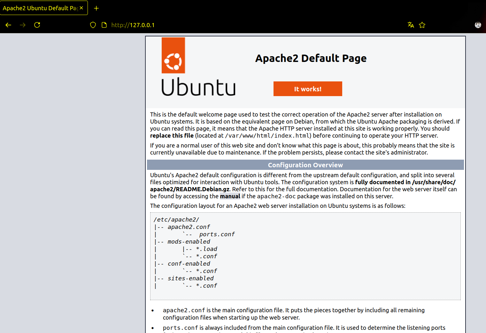
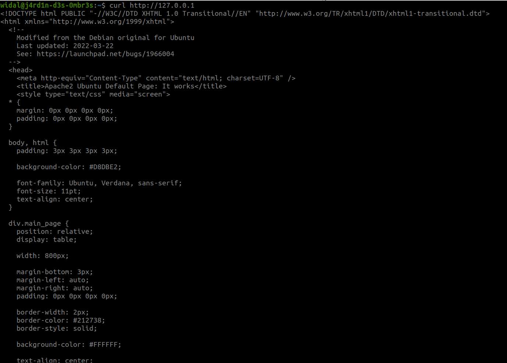

# Introduction

In this section, we will cover service management in Linux.

## Foreword (Repetition is pedagogical XD)

We recommend that you do not use AI to complete the exercises, as you are in the learning phase.

## Prerequisites

Same old story. 😉

# Let’s Begin Exploring

## Services (or Daemons)

Services, also called **daemons**, are essential components of a Linux system. They run in the background, **without direct user interaction**, and perform fundamental tasks for the proper functioning of the system. They ensure the system remains operational and provide additional functionalities.

Generally, there are two main types of services:

### System Services

These are internal services necessary for system startup.  
They handle critical hardware tasks and initialize essential components for the operating system to function.  
They are comparable to the **engine and transmission of a car**: they start as soon as you turn the key and are essential for the car to move.  
Without them, the system could not operate.

### User-Installed Services

These services are added by users or administrators.  
They typically include server applications or other background processes that provide specific functionalities.  
They are like car options (air conditioning, GPS, etc.): not essential for driving the car but very useful for improving comfort or adding features based on the user’s needs.

### TLDR (Let’s Talk Concretely About a Service)

An application does not always need a service to function. However, a service plays a crucial role in managing an application’s lifecycle: it allows the application to start automatically at system boot or to be easily controlled (start, stop, restart) as needed.

Take the example of OpenSSH, which enables remote access to a machine via the SSH protocol. Without a service, you would need to manually execute a complex command each time you want to activate this functionality. Additionally, if the machine restarts, if the service is interrupted accidentally, or if you modify the configuration file, you would need to re-enter that command every time.

This makes application management tedious and unreliable. This is where a service comes in, simplifying all this management. In the case of OpenSSH, this service is called **sshd**. It not only automatically starts OpenSSH at boot but also allows easy management of its operation with commands like **systemctl start sshd**, **systemctl stop sshd**, or **systemctl restart sshd**.

### How to Recognize a Daemon (a Service)?

Daemon names often end with the letter **`d`**.  
For example:
- `sshd`: the SSH daemon (for secure connections),
- `systemd`: the main initialization system,
- `httpd` or `nginx`: web daemons,
- `crond`: task scheduler.

Just as a car relies on its essential components and options to provide a complete experience, a Linux system uses both system services and user services to operate efficiently and meet everyone’s needs.

## Common Objectives Related to Services or Processes

Generally, here are the main actions you want to perform with a service or process:

- **Start / Restart** a service or process
- **Stop** a service or process
- **See what’s happening or what happened** with a service or process
- **Enable / Disable** a service at system startup
- **Find** a service or process

## The Role of systemd

Most modern Linux distributions use **systemd** as a replacement for SystemV as the initialization system (*init system*).  
It is the **first process launched at startup** and carries the process identification number (**PID**) `1`.

Every process in Linux has a unique PID, visible in the `/proc/` directory, where all information about running processes is stored.  
A process can also have a **PPID** (Parent Process ID), meaning it was launched by another process, becoming its **child process**.

# Commands Related to Service Management

## The `systemctl` Command

**systemctl** is the primary tool for managing services, units, and system startup on Linux distributions using systemd (such as Ubuntu, Debian, Fedora, Arch, etc.).

| Action | Command | Description |
|--------|---------|-------------|
| List all services | `systemctl list-units --type=service` | Displays the list of active services |
| Start a service | `sudo systemctl start service_name` | Example: `sudo systemctl start apache2` |
| Check if a service is enabled at startup | `sudo systemctl is-enabled service_name` | Example: `sudo systemctl is-enabled apache2` |
| Stop a service | `sudo systemctl stop service_name` | |
| Restart a service | `sudo systemctl restart service_name` | Useful after a configuration change |
| Display a service’s unit file | `sudo systemctl cat service_name` | Shows the service’s configuration file |
| Reload a service’s configuration | `sudo systemctl reload service_name` | Without fully restarting the service |
| Enable a service at startup | `sudo systemctl enable service_name` | To start automatically at boot |
| Disable a service at startup | `sudo systemctl disable service_name` | To prevent automatic startup |
| Check a service’s status | `systemctl status service_name` | Shows whether the service is active or not |
| Mask (strongly disable) a service | `sudo systemctl mask service_name` | Prevents manual or automatic startup |
| Unmask a service | `sudo systemctl unmask service_name` | Reverses the effect of `mask` |

## The `journalctl` Command

**journalctl** is the tool for reading system or application logs managed by systemd.

| Action | Command | Description |
|--------|---------|-------------|
| View all system logs | `sudo journalctl` | Paged display (use ↑ ↓ to navigate) |
| View logs for a specific service | `sudo journalctl -u service_name` | Example: `sudo journalctl -u ssh` |
| View logs in real time | `sudo journalctl -f` | "Follow" mode (like `tail -f`) |
| View logs since a specific time | `sudo journalctl --since "1 hour ago"` | Options: `yesterday`, `2024-01-01`, etc. |
| View logs up to a certain date | `sudo journalctl --until "2024-01-01 12:00"` | |
| View logs with high priority (errors) | `sudo journalctl -p err` | Priorities: `emerg`, `alert`, `crit`, `err`, `warning`, `notice`, `info`, `debug` |
| View logs from the current boot | `sudo journalctl -b` | `-b -1` for the previous boot |
| View logs related to a PID | `sudo journalctl _PID=1234` | Replace `1234` with a process number |
| View logs sorted by priority | `sudo journalctl -x` | Adds useful explanations to the logs |
| Export logs to a file | `sudo journalctl > logs.txt` or `sudo journalctl -u ssh > ssh_logs.txt` | For later analysis |

<br>

As a reminder, a log (or journal) is a record of events generated by an application, service, or the system.

# Practice ⚔️

## Exercise 1 (Easy)

This exercise involves installing the **Apache HTTP Server** software, which will allow your machine to act as a web server, and then managing its service.

1. Install the Apache software (the package name is **apache2** on Debian-based distributions and **httpd** on RedHat-based distributions)
2. Check the status of the apache2 service
3. Start the apache2 service
4. Check the status of the apache2 service
5. Access the default web page hosted by your web server (open your browser and enter http://127.0.0.1 | If you don’t have a graphical interface, perform a curl on http://127.0.0.1)

Examples of output:






6. Stop the apache2 service and refresh the web page or rerun the curl
7. Ensure the apache2 service starts automatically at system boot. Verify by restarting your machine.
8. Ensure the service is active and display its logs with journalctl
9. Display the unit file of the apache2 service

## Exercise 2 (Let’s Make Things a Bit More Complicated)

This exercise involves creating a custom service (bonjour.service) that executes a simple script.

1. **Create a Bash script** `/usr/local/bin/say_hello.sh` that writes a sentence to a file:

   ```bash
   #!/bin/bash
   while true; do
     echo "Hello, it is $(date)" | sudo tee -a /var/log/bonjour.log > /dev/null
     sleep 60
   done
   ```
   Make it executable:
   ```bash
   sudo chmod +x /usr/local/bin/say_hello.sh
   ```

2. **Create a unit file** for this service:
   ```bash
   sudo nano /etc/systemd/system/bonjour.service
   ```
   Add the following content:
   ```ini
   [Unit]
   Description=Bonjour - Custom Service

   [Service]
   ExecStart=/usr/local/bin/say_hello.sh
   User=root
   Environment="PATH=/usr/bin:/bin"
   StandardOutput=journal

   [Install]
   WantedBy=multi-user.target
   ```

3. **Enable, start, and verify your service**:
   ```bash
   sudo systemctl daemon-reload
   sudo systemctl enable bonjour
   sudo systemctl start bonjour
   sudo systemctl status bonjour
   ```

4. **Check the contents of the logged file**:
   ```bash
   cat /var/log/bonjour.log
   ```
5. **Check the service logs**:
    ```bash
    journalctl -u bonjour
    ```

## Exercise 3 (Deep Dive)

Execute the script to start the challenge like a pro 😉.

* Link to the challenge script: https://raw.githubusercontent.com/N0vachr0n0/NoFD/refs/heads/main/SVC_SYSTEMD_EXO.sh

---
---

## Feedback

ENG: Please give us your feedback about this chapter.
FR: Faites-nous part de votre avis sur ce chapitre.

👉🏾 https://forms.gle/kpgXVDY8EY3twRQV9
