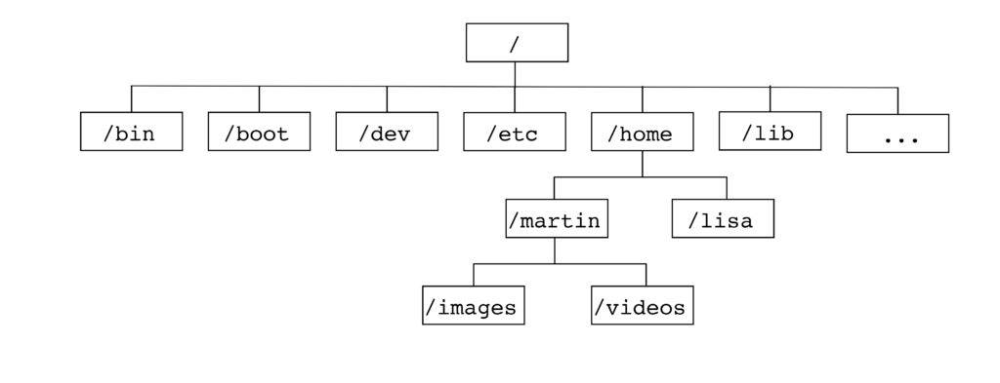
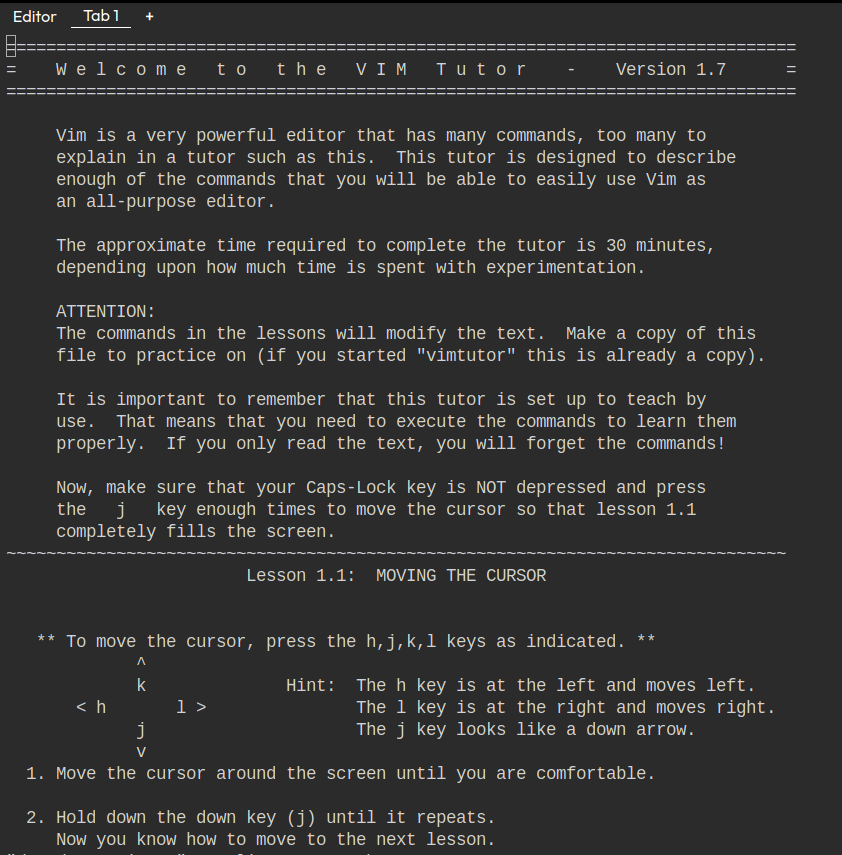

# Introduction

Même s’il existe une multitude de commandes sous Linux, quelques-unes se révèlent indispensables pour profiter pleinement de ce système. Il y a de fortes chances que vous les utiliserez tous les jours.

## Avant-propos

Nous vous recommandons de ne pas utiliser d'IA pour faire les exercices car vous êtes en phase d'apprentissage.


## Prérequis 

* Avoir une machine virtuelle ou un PC ou un environnement sous Linux (Ubuntu idéalement)
* Être résilient XD

**Info:** Si vous n'avez pas d'environnement linux à votre disposition, vous pouvez vous inscrire sur https://killercoda.com et vous rendre ici https://killercoda.com/playgrounds/scenario/ubuntu pour avoir accès à une machine virtuelle sous Ubuntu 24.04 (sans interface graphique bien sûr !!) pendant 1 heure renouvelable gratuitement.

Vous aurez donc cette vue:


<br>

**Bonus pour la team Killerkoda 👨🏾‍💻👩🏾‍💻:**
- Ouvrir son terminal
- Exécuter : 
```bash
echo "export PS1='\[\e[01;31m\]\u@\h:\w# \[\e[00m\]'" >> .bashrc
source ~/.bashrc
```

Vous aurez à présent cette vue:


# À la découverte du terminal Linux

Qui dit terminal Linux, dit principalement invite de commande (prompt) et interpréteur de commandes (shell). Mais aussi les commandes.

Exemple de terminal Linux:


1. L’invite de commande (prompt)
   - C’est la ligne qui indique où vous êtes et qui vous êtes dans le système. Elle peut varier selon la distribution et la configuration, mais elle ressemble souvent à ça :  
     Exemple : `utilisateur@machine:répertoire$`  
     - `utilisateur` : Votre nom d’utilisateur.  
     - `machine` : Le nom de l’hôte (ordinateur).  
     - `répertoire` : Le dossier actuel (ex. `~` pour le dossier personnel).  
     - `$` : Signe pour un utilisateur standard (`#` pour root).

2. L’interpréteur de commandes (shell)
   - Le programme qui exécute les commandes tapées. Le plus courant est **Bash** (Bourne Again Shell), mais il en existe d’autres comme **Zsh**, **Fish** ou **Tcsh**.  
   - Il traduit vos instructions en actions pour le système.

3. Les commandes
   - Les instructions que vous entrez, comme `ls`, `cd`, `cat` ou encore `cowsay`, etc. Elles peuvent être :  
     - **Internes** : Intégrées au shell (ex. `cd` pour changer de répertoire).  
     - **Externes** : Programmes séparés (ex. `ls` pour lister les fichiers).


# L'arborescence du système Linux

L'arborescence du système Linux, c'est comme une grande armoire bien organisée avec plein de tiroirs et de dossiers. C'est la façon dont les fichiers et les répertoires sont structurés dans un système Linux. Tout commence à partir d'un point unique qu'on appelle la racine, notée simplement par un slash : /. À partir de là, tout s'organise en branches, comme un arbre (d'où le nom "arborescence").

Voici les principaux répertoires et leur rôle:

- **bin/** : (binary) Programmes utilisateurs
- **sbin/** : (super binary) Programmes super-utilisateurs
- **lib/** : (library) Librairies utilisées par les applications
- **etc/** : (et caetera) Configuration des applications
- **tmp/** : (temporary) Répertoire temporaire accessible par tous
- **var/** : (variable) Données applicatives dont la taille varie (base de données, site web, journaux systèmes, etc.)
- **boot/** : (boot) Noyau Linux chargé au démarrage
- **dev/** : (devices) Accès aux périphériques
- **proc/** : (process) Répertoire virtuel contenant les informations sur les processus, le noyau et ses modules utilisés par les commandes systèmes
- **opt/** : (optionnel) Logiciel propriétaire ou non standard
- **root/** : Répertoire personnel de l'utilisateur root
- **home/** : Répertoire personnel des utilisateurs où se trouvent leurs fichiers
- **mnt/** : (mount points) Répertoire dans lequel sont montés les périphériques


Ci-dessous une petite illustration:



<br>

**A tester 👨🏾‍💻👩🏾‍💻:**
- Ouvrir son terminal
- Exécuter: 
   ```bash
   tree -d -L 1 /
   ```

# Comparaison entre l'arborescence Linux et Windows (BONUS)

Comparons l'arborescence de Linux avec celle de Windows, comme si on comparait deux armoires avec des logiques de rangement différentes.

### Linux : L'arborescence unifiée (tout part de `/`)
Sous Linux, tout commence à la **racine** (`/`) et s’organise en une seule grande structure. Chaque répertoire a une fonction bien définie :
- **/home** : L’espace perso des utilisateurs.
- **/bin** : Les outils de base.
- **/etc** : Les fichiers de configuration.
- etc.

C’est un système **unifié** : peu importe où tu installes Linux ou quel disque tu ajoutes, tout est vu comme une branche de cet arbre unique. Par exemple, un disque externe pourrait être monté sous `/mnt` ou `/media`.

### Windows : Une structure basée sur des lettres de lecteurs
Sous Windows, il n’y a pas une seule racine, mais plusieurs "armoires" séparées, identifiées par des **lettres** (C:, D:, etc.). Chaque lettre représente un disque ou une partition, et l’organisation est moins standardisée. Voici les équivalents principaux :
- **C:\Users** (ou C:\Utilisateurs) : Comme `/home` sous Linux, l’espace perso des utilisateurs.
- **C:\Windows\System32** : Proche de `/bin` ou `/usr/bin`, là où sont les fichiers essentiels pour faire tourner le système.
- **C:\Windows** : Similaire à `/etc`, avec des fichiers de configuration (mais tout est mélangé avec le reste).
- **D:** ou autre : Si tu branches un disque externe ou une clé USB, il aura sa propre lettre et son propre "arbre", indépendant de C:.

### Les grandes différences
1. **Racine unique vs lettres multiples** :
   - Linux : Tout est connecté à `/`.
   - Windows : Chaque disque est une île séparée (C:, D:, etc.).
2. **Rôles clairs vs mélange** :
   - Linux sépare bien les choses (configs dans `/etc`, programmes dans `/bin`).
   - Windows met souvent tout dans `C:\Windows` ou `C:\Program Files`, ce qui peut sembler moins structuré.
3. **Chemins** :
   - Linux : `/home/user/doc.txt`.
   - Windows : `C:\Users\User\doc.txt`, avec des barres inversées (`\`).

### Exemple concret
Imaginons que tu veuilles ranger un fichier perso :
- **Sur Linux** : Il va dans `/home/ton_nom/mes_docs`.
- **Sur Windows** : Il va dans `C:\Users\TonNom\Mes Documents`.

Et si tu branches une clé USB :
- **Sur Linux** : Elle apparaît sous `/media/ton_nom/clé`.
- **Sur Windows** : Elle devient `E:` ou une autre lettre.

### En résumé
Linux est comme une grande bibliothèque avec un seul point d’entrée et des rayons bien étiquetés, tandis que Windows est comme plusieurs petites bibliothèques indépendantes, chacune avec son propre système de rangement. Tu vois la différence ? Si tu veux, je peux approfondir un point précis !


# Les commandes de base 

**Info :** Si vous avez l’habitude d’utiliser votre interface graphique pour travailler votre objectif sera de reproduire tout ce que vous savez faire en interface graphique dans le terminal linux (créer/déplacer/copier/supprimer des fichiers/dossiers, créer des raccourcis, se déplacer dans des répertoires/dossiers ...)

## Commandes de navigation et gestion des fichiers

- **`pwd`** : Affiche le chemin absolu du répertoire actuel (ex. `/home/user`).
- **`ls`** : Liste les fichiers et dossiers (remplacée par `dir` sur certaines distros, mais `ls` est standard).  
  - Options utiles : `ls -l` (détails), `ls -a` (fichiers cachés).
- **`ln`** : Crée des liens symboliques ou physiques entre fichiers (ex. `ln -s fichier.txt lien_symbolique` pour un lien symbolique, ou `ln fichier.txt lien_physique` pour un lien physique).
- **`cd`** : Change de répertoire (ex. `cd /var/www` ou `cd ..` pour remonter).
- **`mkdir`** : Crée un nouveau dossier (ex. `mkdir nouveau_dossier`).
- **`rmdir`** : Supprime un dossier vide (ex. `rmdir dossier_vide`).
- **`touch`** : Crée un fichier vide (ex. `touch fichier.txt`).
- **`cp`** : Copie des fichiers ou dossiers (ex. `cp fichier.txt copie.txt`).
- **`mv`** : Déplace ou renomme des fichiers (ex. `mv fichier.txt /autre/chemin`).
- **`rm`** : Supprime des fichiers ou dossiers (ex. `rm fichier.txt`, `rm -r dossier` pour récursif).
- **`tar`** : Archive ou désarchive des fichiers (ex. `tar -cvf archive.tar dossier` pour créer une archive, ou `tar -xvf archive.tar` pour extraire).
- **`zip`** : Compresse des fichiers en format ZIP (ex. `zip archive.zip fichier.txt` pour compresser, ou `unzip archive.zip` pour décompresser).

## Commandes d’affichage et manipulation de contenu

- **`cat`** : Affiche le contenu d’un fichier (ex. `cat fichier.txt`).
- **`less`** : Affiche un fichier page par page (ex. `less fichier.txt`, quitter avec `q`).
- **`more`** : Similaire à `less`, mais moins flexible (ex. `more fichier.txt`).
- **`echo`** : Affiche du texte ou des variables (ex. `echo "Bonjour"`).
- **`head`** : Affiche les premières lignes d’un fichier (ex. `head -n 5 fichier.txt`).
- **`tail`** : Affiche les dernières lignes (ex. `tail -n 5 fichier.txt`).
- **`nano`** : Ouvre un éditeur de texte simple dans le terminal (ex. `nano fichier.txt`, sauvegarder avec `Ctrl+O`, quitter avec `Ctrl+X`).
- **`vi`** : Ouvre l’éditeur de texte Vi (ex. `vi fichier.txt`, passez en mode insertion avec `i`, sauvegarder et quitter avec `:wq`).
- **`vim`** : Version améliorée de Vi (ex. `vim fichier.txt`, même commandes que Vi mais avec plus de fonctionnalités).
- **`which`** : Affiche le chemin complet d'une commande ou d'un programme (ex. `which python` pour voir où se trouve le programme Python).

## Commandes de recherche et filtrage

- **`find`** : Recherche des fichiers ou dossiers dans une arborescence (ex. `find /home -name "fichier.txt"` pour chercher un fichier nommé `fichier.txt` dans `/home`).
- **`grep`** : Recherche un motif dans des fichiers ou une sortie (ex. `grep "mot" fichier.txt` pour trouver "mot" dans `fichier.txt`, ou `ls | grep "doc"` pour filtrer les résultats de `ls`).

## Commandes d’information système

- **`whoami`** : Affiche l’utilisateur actuel.
- **`uname`** : Donne des infos sur le système (ex. `uname -a` pour tout).
- **`df`** : Affiche l’espace disque disponible (ex. `df -h` pour format lisible).
- **`du`** : Calcule la taille d’un dossier (ex. `du -sh dossier`).
- **`top`** : Montre les processus en cours (comme un gestionnaire des tâches).
- **`nproc`** : Affiche le nombre de processeurs (cœurs) disponibles sur la machine.

## Commandes de gestion des permissions

- **`chmod`** : Modifie les permissions d’un fichier (ex. `chmod +x script.sh` pour exécutable).
- **`chown`** : Change le propriétaire d’un fichier (ex. `chown user fichier.txt`).
- **`ls -l`** : Vérifie les permissions (ex. `-rwxr-xr-x`).

## Commandes réseau

- **`ping`** : Teste la connectivité réseau (ex. `ping google.com`).
- **`curl`** : Récupère des données d’une URL (ex. `curl http://example.com`).
- **`wget`** : Télécharge des fichiers depuis le web (ex. `wget http://example.com/fichier`).

## Commandes utilitaires

- **`man`** : Affiche le manuel d’une commande (ex. `man ls`).
- **`history`** : Liste les commandes précédentes.
- **`clear`** : Nettoie l’écran du terminal.
- **`sudo`** : Exécute une commande en tant qu’administrateur (ex. `sudo apt update`).
- **`exit`** : Ferme le terminal ou la session.
- **`alias`** : Crée un raccourci pour une commande (ex. `alias ll="ls -l"` pour que `ll` exécute `ls -l`).

## Redirections et pipes

- **`>`** : Redirige la sortie vers un fichier (ex. `echo "texte" > fichier.txt`).
- **`>>`** : Ajoute à un fichier sans écraser (ex. `echo "suite" >> fichier.txt`).
- **`|`** : Relie des commandes (ex. `ls | grep "mot"`).

Eh bien ! Ça fait une panoplie de commandes. 
Il faut noter que c'est à force de pratiquer que vous retiendrez ces différentes commandes. De plus, l'option **--help** et la commande **man** seront vos meilleurs amis pour savoir comment utiliser une commande.

<br>

**A tester 👨🏾‍💻👩🏾‍💻:**
- Ouvrir son terminal
- Exécuter: 
   ```bash
   cp --help
   man find
   ```


# Entraînement ⚔️

## Exercice 1

* Faire au moins les 10 premiers challenge: https://cmdchallenge.com/


## Exercice 2

Les exercices de cette partie seront sous forme de challenge. Il y aura cinq challenges. Chaque challenge est accessible via un script qu'il faudra exécuter pour débuter.

* Lien du script du challenge 1: https://raw.githubusercontent.com/N0vachr0n0/NoFD/refs/heads/main/BC_EXO_1.sh
* Lien du script du challenge 2: https://raw.githubusercontent.com/N0vachr0n0/NoFD/refs/heads/main/BC_EXO_2.sh
* Lien du script du challenge 3: https://raw.githubusercontent.com/N0vachr0n0/NoFD/refs/heads/main/BC_EXO_3.sh
* Lien du script du challenge 4: https://raw.githubusercontent.com/N0vachr0n0/NoFD/refs/heads/main/BC_EXO_4.sh
* Lien du script du challenge 5: https://raw.githubusercontent.com/N0vachr0n0/NoFD/refs/heads/main/BC_EXO_5.sh


Ci-dessous un exemple d'exécution:

```bash
# On télécharge le script du challenge 1
curl -LO https://raw.githubusercontent.com/N0vachr0n0/NoFD/refs/heads/main/BC_EXO_1.sh

# On le rend exécutable
chmod +x BC_EXO_1.sh

# On l'exécute pour démarrer le challenge
./BC_EXO_1.sh
```

## Exercice 3 (Deep dive)

* Faire ce challenge https://sadservers.com/scenario/saskatoon


## Exercice 4 (Bonus)

Pour apprendre à maitriser / se familiariser avec l'éditeur de texte **vim**, nous vous recommandons de passer par **vimtutor**.
Ouvrez votre terminal et tapez **vimtutor**. Vous aurez un retour similaire à:



---
---

## Feedback

> ENG: Please give us your feedback about this chapter.

> FR: Faites-nous part de votre avis sur ce chapitre.

> 👉🏾 https://forms.gle/gk932mwzgjJmbtc87