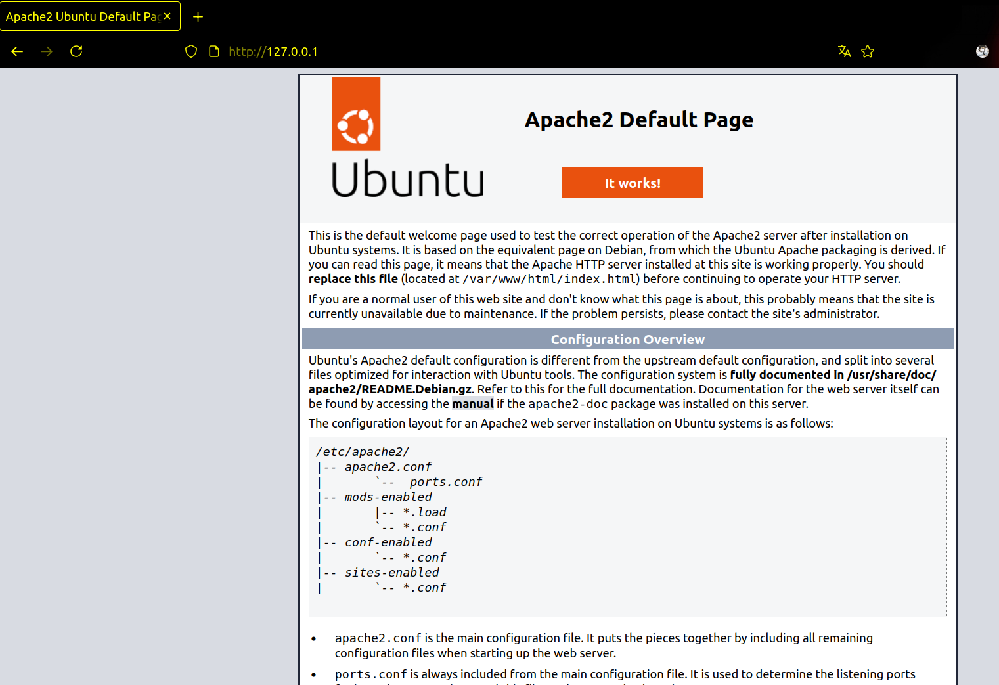
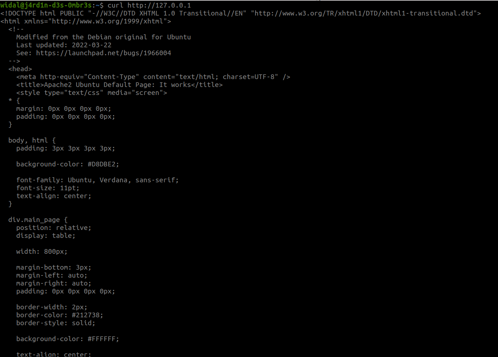

# Introduction

Dans cette partie, nous aborderons la gestion des services sur Linux. 

## Avant-propos (La répétition est pédagogique XD)

Nous vous recommandons de ne pas utiliser d'IA pour faire les exercices car vous êtes en phase d'apprentissage.

## Prérequis 

Toujours la même histoire. 😉

# Débutons l'exploration

## Les services (ou démons)

Les services, aussi appelés **démons** (*daemons* en anglais), sont des composants essentiels d’un système Linux. Ils fonctionnent en arrière-plan, **sans interaction directe avec l’utilisateur**, et assurent des tâches fondamentales pour le bon fonctionnement du système. Ils permettent notamment de maintenir le système opérationnel et d’ajouter des fonctionnalités supplémentaires.

Généralement, on distingue deux grands types de services :


### Services système

Ce sont les services internes nécessaires au démarrage du système.  
Ils s’occupent de tâches matérielles importantes et initialisent les composants indispensables au fonctionnement du système d’exploitation.  
Ils sont comparables au **moteur et à la transmission d’une voiture** : ils se lancent dès que vous tournez la clé de contact et sont indispensables pour que la voiture avance.  
Sans eux, le système ne pourrait pas fonctionner.


### Services installés par l’utilisateur

Ces services sont ajoutés par les utilisateurs ou les administrateurs.  
Ils incluent généralement des applications serveur ou d’autres processus en arrière-plan qui offrent des fonctionnalités spécifiques.  
Ce sont comme les options d’une voiture (climatisation, GPS...): non essentiels pour faire rouler la voiture, mais très utiles pour améliorer le confort ou ajouter des fonctionnalités selon les besoins de l’utilisateur.


### TLDR (Parlons concrètement d'un service)

Une application n’a pas toujours besoin d’un service pour fonctionner. Cependant, un service joue un rôle essentiel dans la gestion du cycle de vie d’une application : il permet notamment de la démarrer automatiquement au lancement du système, ou de la contrôler facilement (démarrer, arrêter, redémarrer) selon les besoins. 

Prenons l’exemple d’OpenSSH, qui permet d’accéder à une machine à distance via le protocole SSH. Sans service, il faudrait exécuter manuellement une commande assez complexe chaque fois que l’on souhaite activer cette fonctionnalité. De plus, si la machine redémarre, si le service est interrompu accidentellement ou si vous modifiez le fichier de configuration, il faudrait retaper cette commande à chaque fois. 

Cela rend la gestion de l’application fastidieuse et peu fiable. C’est là qu’intervient un service, qui simplifie toute cette gestion. Dans le cas d’OpenSSH, ce service s’appelle **sshd**. Il permet non seulement de lancer automatiquement OpenSSH au démarrage, mais aussi de gérer son fonctionnement simplement avec des commandes comme **systemctl start sshd**, **systemctl stop sshd** ou **systemctl restart sshd**. 
     

### Comment reconnaître un démon (un service) ?

Les noms des démons se terminent souvent par la lettre **`d`**.  
Par exemple :
- `sshd` : le démon SSH (pour les connexions sécurisées),
- `systemd` : le système d'initialisation principal,
- `httpd` ou `nginx` : démons web,
- `crond` : gestionnaire de tâches planifiées.

Tout comme une voiture repose sur ses pièces essentielles ainsi que sur ses options pour offrir une expérience complète, un système Linux utilise à la fois les services système et les services utilisateur pour fonctionner efficacement et répondre aux besoins de chacun.


## Objectifs courants liés aux services ou processus

En général, voici les actions principales que l’on souhaite effectuer avec un service ou un processus :

- **Démarrer / Redémarrer** un service ou un processus
- **Arrêter** un service ou un processus
- **Voir ce qu’il se passe ou ce qui s’est passé** avec un service ou un processus
- **Activer / Désactiver** un service au démarrage du système
- **Trouver** un service ou un processus


## Le rôle de systemd

La plupart des distributions Linux modernes utilisent **systemd** en remplacement de SystemV comme système d'initialisation (*init system*).  
C’est le **premier processus lancé au démarrage** du système, et il porte le numéro d’identification de processus (**PID**) `1`.

Chaque processus sous Linux possède un PID unique, visible dans le répertoire `/proc/`, où sont stockées toutes les informations concernant les processus en cours.  
Un processus peut également avoir un **PPID** (Parent Process ID), ce qui signifie qu’il a été lancé par un autre processus, devenant alors son **processus enfant**.

# Les commandes en rapport avec la gestion des services

## La commande systemctl

**systemctl** est l’outil principal pour gérer les services, les unités et le démarrage du système  sur les distributions Linux utilisant systemd  (comme Ubuntu, Debian, Fedora, Arch, etc.).

| Action | Commande | Description |
|--------|----------|-------------|
| Lister tous les services | `systemctl list-units --type=service` | Affiche la liste des services actifs |
| Démarrer un service | `sudo systemctl start nom_du_service` | Exemple : `sudo systemctl start apache2` |
| Voir si un service est bien activé au démarrage | `sudo systemctl is-enabled nom_du_service` | Exemple : `sudo systemctl is-enabled apache2` |
| Arrêter un service | `sudo systemctl stop nom_du_service` | |
| Redémarrer un service | `sudo systemctl restart nom_du_service` | Utile après une modification de configuration |
| Afficher l'unit file d'un service | `sudo systemctl cat nom_du_service` | Affiche le fichier de configuration d'un service |
| Recharger la configuration d’un service | `sudo systemctl reload nom_du_service` | Sans redémarrer complètement le service |
| Activer un service au démarrage | `sudo systemctl enable nom_du_service` | Pour qu’il démarre automatiquement |
| Désactiver un service au démarrage | `sudo systemctl disable nom_du_service` | Pour l’empêcher de se lancer automatiquement |
| Vérifier l’état d’un service | `systemctl status nom_du_service` | Montre si le service est actif ou non |
| Masquer (désactiver fortement) un service | `sudo systemctl mask nom_du_service` | Empêche tout lancement manuel ou automatique |
| Démasquer un service | `sudo systemctl unmask nom_du_service` | Annule l’effet de `mask` |


## La commande journalctl

**journalctl** est l’outil pour lire les logs du système ou des applications géré(e)s par systemd.

| Action | Commande | Description |
|--------|----------|-------------|
| Voir tous les logs du système | `sudo journalctl` | Affichage paginé (utilise ↑ ↓ pour naviguer) |
| Voir les logs d’un service spécifique | `sudo journalctl -u nom_du_service` | Exemple : `sudo journalctl -u ssh` |
| Voir les logs en temps réel | `sudo journalctl -f` | Mode "suivi" (comme `tail -f`) |
| Voir les logs depuis un moment précis | `sudo journalctl --since "1 hour ago"` | Options possibles : `yesterday`, `2024-01-01`, etc. |
| Voir les logs jusqu’à une certaine date | `sudo journalctl --until "2024-01-01 12:00"` | |
| Voir les logs avec priorité élevée (erreurs) | `sudo journalctl -p err` | Priorités : `emerg`, `alert`, `crit`, `err`, `warning`, `notice`, `info`, `debug` |
| Voir les logs du boot actuel | `sudo journalctl -b` | `-b -1` pour le boot précédent |
| Voir les logs liés à un PID | `sudo journalctl _PID=1234` | Remplacer `1234` par un numéro de processus |
| Voir les logs triés par priorité | `sudo journalctl -x` | Ajoute des explications utiles dans les logs |
| Exporter les logs dans un fichier | `sudo journalctl > logs.txt` ou `sudo journalctl -u ssh > ssh_logs.txt` | Pour analyse ultérieure |

<br>

Pour rappel, un log (ou journal de bord) est un enregistrement d'événements générés par une application, un service ou le système.


# Entraînement ⚔️

## Exercice 1 (Easy)

Cet exercice consistera à installer le logiciel **Apache HTTP Server** qui permettra à votre machine de jouer le rôle d'un serveur web. Et par la suite de passer à la gestion du service de ce dernier.

1. Installez le logiciel Apache (le nom du package est **apache2** sur les distributions Debian et **httpd** sur les distro RedHat)
2. Vérifiez l'état du service apache2
3. Démarrez le service apache2
4. Vérifiez l'état du service apache2
5. Accédez à la page web par défaut hébergée par votre serveur web (Ouvrez votre navigateur et saisir http://127.0.0.1 | Si vous n'avez pas d'interface graphique, effectuez un curl sur http://127.0.0.1 )

Exemples de retour:






6. Stoppez le service apache2 et actualisez la page web ou relancez le curl
7. Faites en sorte que le service apache2 démarre de manière automatique au lancement de votre machine. Vérifiez en redémarrant votre machine.
8. Assurez vous le service soit actif et affichez ses logs avec journalctl
9. Afficher le unit file du service apache2


## Exercice 2 (On complique un peu les choses)

Cet exercice consistera à créer un service personnalisé (bonjour.service) qui exécute un script simple.

1. **Créez un script Bash** `/usr/local/bin/dis_bonjour.sh` qui écrit une phrase dans un fichier :

   ```bash
   #!/bin/bash
   while true; do
     echo "Bonjour, il est $(date)" | sudo tee -a /var/log/bonjour.log > /dev/null
     sleep 60
   done
   ```
   Rendez-le exécutable :
   ```bash
   sudo chmod +x /usr/local/bin/dis_bonjour.sh
   ```

2. **Créez une unit file** pour ce service :
   ```bash
   sudo nano /etc/systemd/system/bonjour.service
   ```
   Ajoute-y le contenu suivant :
   ```ini
   [Unit]
   Description=Bonjour - Service personnalisé

   [Service]
   ExecStart=/usr/local/bin/dis_bonjour.sh
   User=root
   Environment="PATH=/usr/bin:/bin"
   StandardOutput=journal

   [Install]
   WantedBy=multi-user.target
   ```

3. **Activez, lancez et vérifiez votre service** :
   ```bash
   sudo systemctl daemon-reload
   sudo systemctl enable bonjour
   sudo systemctl start bonjour
   sudo systemctl status bonjour
   ```

4. **Vérifiez le contenu du fichier journalisé** :
   ```bash
   cat /var/log/bonjour.log
   ```
5. **Vérifier les logs du services** :
    ```bash
    journalctl -u bonjour
    ```

## Exercice 3 (Deep Dive)

Exécuter le script pour débuter le challenge comme un grand 😉.

* Lien du script du challenge: https://raw.githubusercontent.com/N0vachr0n0/NoFD/refs/heads/main/SVC_SYSTEMD_EXO.sh